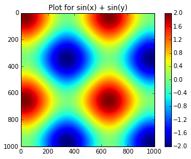

    import matplotlib.pyplot as plt
    import numpy as np
    import codecs

    %matplotlib inline

    A = np.array([1, 2, 3, 4])

    B = np.array([100, 200, 300, 400])

    C = np.array([True, True, False, False])

    answer = [(a_val if cond else b_val) for a_val, b_val, cond in zip(A, B, C)]

    answer

    [1, 2, 300, 400]

    #Getting the same results with where function

    answer2 = np.where(C, A, B)

    answer2

    array([  1,   2, 300, 400])

    from numpy.random import randn

    arr = randn(5,5)

    arr

    array([[ 0.72983713, -0.29263623, -0.26907291, -0.55095603,  0.63501219],
           [-1.15691973, -0.77634801, -0.21378131,  0.56747558, -0.38836383],
           [ 0.11722875,  0.44916423, -0.26452679,  2.49216295, -1.74538336],
           [ 1.31243796, -0.99356144, -0.23397941, -1.04678917, -0.1683297 ],
           [ 1.68653762, -1.28770121,  0.28819088,  2.17008097, -0.81037705]])

    np.where(arr < 0, 0, arr)

    array([[ 0.72983713,  0.        ,  0.        ,  0.        ,  0.63501219],
           [ 0.        ,  0.        ,  0.        ,  0.56747558,  0.        ],
           [ 0.11722875,  0.44916423,  0.        ,  2.49216295,  0.        ],
           [ 1.31243796,  0.        ,  0.        ,  0.        ,  0.        ],
           [ 1.68653762,  0.        ,  0.28819088,  2.17008097,  0.        ]])

    arr1 = np.array([[1,2,3],[4,5,6],[7,8,9]])
    arr1

    array([[1, 2, 3],
           [4, 5, 6],
           [7, 8, 9]])

    np.sum(arr1)

    45

    arr1.sum(1)

    array([ 6, 15, 24])

    arr1.sum(0)

    array([12, 15, 18])

    points = np.arange(-5,5,0.01)

    dx,dy = np.meshgrid(points,points)

    z = (np.sin(dx) + np.sin(dy))

    #Plot out the 2d array
    plt.imshow(z)
    
    #Plot with a colorbar
    plt.colorbar()
    
    #Give the plot a title
    plt.title("Plot for sin(x) + sin(y)")

    <matplotlib.text.Text at 0x10a1df650>

    from pandas import Series, DataFrame

    import pandas as pd

    import json

    with open('errorsMoney.json') as f:
        contents = f.read().encode('unicode-escape').decode('ascii')

    data = json.loads(contents)

    data

    {u'_shards': {u'failed': 0, u'successful': 5, u'total': 5},
     u'hits': {u'hits': [{u'_id': u'c86dedb0-a187-492b-819c-d469bb582c9a',
        u'_index': u'snitch_money_telus',
        u'_score': 1.0,
        u'_source': {u'apiLevel': u'2',
         u'appBuild': u'3',
         u'appName': u'Telus Mobile',
         u'appVersion': u'3.0.0',
         u'applicationState': u'ACTIVE',
         u'banId': u'25729211',
         u'batteryLevel': u'0.450000',
         u'batteryState': u'UNPLUGGED',
         u'carrierName': u'TELUS',
         u'cellularNetworkTechnology': u'WCDMA',
         u'city': u'Sainte-Marie',
         u'country': u'Canada',
         u'countryIso': u'CA',
         u'countrySubdivisionIso': u'CA-QC',
         u'cpuUsage': u'3.40',
         u'currencyCode': u'UNKNOWN',
         u'currencyValue': u'63',
         u'customerCode': u'TELUS',
         u'deviceBrand': u'apple',
         u'deviceCsdCapable': u'false',
         u'deviceEdgeCapable': u'true',
         u'deviceGprsCapable': u'true',
         u'deviceHscsdCapable': u'UNKNOWN',
         u'deviceHsdpaCapable': u'UNKNOWN',
         u'deviceHspaEvolvedCapable': u'UNKNOWN',
         u'deviceIdentifier': u'CF6059DA-D235-4F60-A323-7FC18315606D',
         u'deviceLteAdvancedCapable': u'false',
         u'deviceLteCapable': u'false',
         u'deviceMarketingName': u'iPhone 4S',
         u'deviceModel': u'iPhone4,1',
         u'deviceOrientation': u'PORTRAIT',
         u'deviceResolution': u'640x960',
         u'deviceScale': u'UNKNOWN',
         u'deviceUmtsCapable': u'UNKNOWN',
         u'domainOrigin': u'collect-br.mobilecloudcare.com',
         u'eventAction': u'UNKNOWN',
         u'eventCategory': u'Bill Payment',
         u'eventDate': u'2014-12-06',
         u'eventDateTime': u'2014-12-06T03:05:46',
         u'eventName': u'Bill Payment',
         u'eventOrigin': u'UNDEFINED',
         u'eventStatus': u'ERROR',
         u'eventType': u'money',
         u'eventValue': u'63',
         u'freeMemory': u'15',
         u'generatedUserAgent': u'Mozilla/5.0 (iPhone4,1; U; CPU iPhone OS 7.1.2 like Mac OS X; fr) AppleWebKit/528.18 (KHTML, like Gecko) Version/4.0 Mobile/7A341 Safari/7.1.2',
         u'geoJson': [u'-71.0188', u'46.4417'],
         u'geoOrigin': u'GEO_FROM_IP',
         u'googleAnalyticsUserAgent': u'GoogleAnalytics/3.02 (iPhone; U; CPU iPhone OS 7.1.2 like Mac OS X; fr)',
         u'language': u'fr',
         u'location': u'46.4417,-71.0188',
         u'mobileCountryCode': u'000',
         u'mobileNetworkCode': u'220',
         u'networkName': u'Telus Communications',
         u'networkType': u'WIFI',
         u'originIp': u'207.167.211.161',
         u'originalTimezone': u'America/Montreal',
         u'osName': u'iPhone OS',
         u'osNameVersion': u'iPhone OS 7.1.2',
         u'osVersion': u'7.1.2',
         u'planType': u'postpaid',
         u'primaryHardwareType': u'Mobile Phone',
         u'profileEnvironment': u'PRODUCTION',
         u'profileID': u'5b9d6d43-b5b5-45b2-aa7d-cfe646c8aac1',
         u'profileName': u'Telus - iPhone - Production',
         u'profilePlatform': u'IPHONE',
         u'proximityState': u'0',
         u'requestId': u'c86dedb0-a187-492b-819c-d469bb582c9a',
         u'selectedLanguage': u'fr',
         u'sequenceNumber': u'68',
         u'sessionIdentifier': u'fd82a581-bf22-4857-9a65-539962077dab',
         u'specificSubdivision': u'Quebec',
         u'specificSubdivisionIso': u'QC',
         u'subscriberId': u'4182093283',
         u'systemMemory': 0,
         u'time_buckets': {u'day-month': u'06',
          u'day-time': u'2014-12-06-03',
          u'day-year': u'340',
          u'full': u'2014-12-06-03-05-46',
          u'month': u'12',
          u'week-year': u'49',
          u'year': u'2014',
          u'year-month': u'2014-12',
          u'year-month-day': u'2014-12-06'},
         u'timestamp': u'1417835146871',
         u'timezone': u'GMT',
         u'transactionAction': u'UNKNOWN',
         u'transactionGroup': u'Bill Payment',
         u'transactionID': u'UNKNOWN',
         u'transactionItem': u'Bill Payment',
         u'transactionMethod': u'Card',
         u'transactionResponse': u'UNKNOWN',
         u'userAgent': u'My Account/3 (iPhone; iOS 7.1.2; Scale/2.00)',
         u'userRole': u'AccountOwner',
         u'yearReleased': u'0000'},
        u'_type': u'snitch_event_type'},
       {u'_id': u'92897315-a34c-4ab1-9729-6128e56c2cdc',
        u'_index': u'snitch_money_telus',
        u'_score': 1.0,
        u'_source': {u'apiLevel': u'2',
         u'appBuild': u'3',
         u'appName': u'Telus Mobile',
         u'appVersion': u'3.0.0',
         u'applicationState': u'ACTIVE',
         u'banId': u'25729211',
         u'batteryLevel': u'0.450000',
         u'batteryState': u'UNPLUGGED',
         u'carrierName': u'TELUS',
         u'cellularNetworkTechnology': u'WCDMA',
         u'city': u'Sainte-Marie',
         u'country': u'Canada',
         u'countryIso': u'CA',
         u'countrySubdivisionIso': u'CA-QC',
         u'cpuUsage': u'3.20',
         u'currencyCode': u'UNKNOWN',
         u'currencyValue': u'63',
         u'customerCode': u'TELUS',
         u'deviceBrand': u'apple',
         u'deviceCsdCapable': u'false',
         u'deviceEdgeCapable': u'true',
         u'deviceGprsCapable': u'true',
         u'deviceHscsdCapable': u'UNKNOWN',
         u'deviceHsdpaCapable': u'UNKNOWN',
         u'deviceHspaEvolvedCapable': u'UNKNOWN',
         u'deviceIdentifier': u'CF6059DA-D235-4F60-A323-7FC18315606D',
         u'deviceLteAdvancedCapable': u'false',
         u'deviceLteCapable': u'false',
         u'deviceMarketingName': u'iPhone 4S',
         u'deviceModel': u'iPhone4,1',
         u'deviceOrientation': u'PORTRAIT',
         u'deviceResolution': u'640x960',
         u'deviceScale': u'UNKNOWN',
         u'deviceUmtsCapable': u'UNKNOWN',
         u'domainOrigin': u'collect-br.mobilecloudcare.com',
         u'eventAction': u'UNKNOWN',
         u'eventCategory': u'Bill Payment',
         u'eventDate': u'2014-12-06',
         u'eventDateTime': u'2014-12-06T03:03:34',
         u'eventName': u'Bill Payment',
         u'eventOrigin': u'UNDEFINED',
         u'eventStatus': u'ERROR',
         u'eventType': u'money',
         u'eventValue': u'63',
         u'freeMemory': u'15',
         u'generatedUserAgent': u'Mozilla/5.0 (iPhone4,1; U; CPU iPhone OS 7.1.2 like Mac OS X; fr) AppleWebKit/528.18 (KHTML, like Gecko) Version/4.0 Mobile/7A341 Safari/7.1.2',
         u'geoJson': [u'-71.0188', u'46.4417'],
         u'geoOrigin': u'GEO_FROM_IP',
         u'googleAnalyticsUserAgent': u'GoogleAnalytics/3.02 (iPhone; U; CPU iPhone OS 7.1.2 like Mac OS X; fr)',
         u'language': u'fr',
         u'location': u'46.4417,-71.0188',
         u'mobileCountryCode': u'000',
         u'mobileNetworkCode': u'220',
         u'networkName': u'Telus Communications',
         u'networkType': u'WIFI',
         u'originIp': u'207.167.211.161',
         u'originalTimezone': u'America/Montreal',
         u'osName': u'iPhone OS',
         u'osNameVersion': u'iPhone OS 7.1.2',
         u'osVersion': u'7.1.2',
         u'planType': u'postpaid',
         u'primaryHardwareType': u'Mobile Phone',
         u'profileEnvironment': u'PRODUCTION',
         u'profileID': u'5b9d6d43-b5b5-45b2-aa7d-cfe646c8aac1',
         u'profileName': u'Telus - iPhone - Production',
         u'profilePlatform': u'IPHONE',
         u'proximityState': u'0',
         u'requestId': u'92897315-a34c-4ab1-9729-6128e56c2cdc',
         u'selectedLanguage': u'fr',
         u'sequenceNumber': u'46',
         u'sessionIdentifier': u'fd82a581-bf22-4857-9a65-539962077dab',
         u'specificSubdivision': u'Quebec',
         u'specificSubdivisionIso': u'QC',
         u'subscriberId': u'4182093283',
         u'systemMemory': 0,
         u'time_buckets': {u'day-month': u'06',
          u'day-time': u'2014-12-06-03',
          u'day-year': u'340',
          u'full': u'2014-12-06-03-03-34',
          u'month': u'12',
          u'week-year': u'49',
          u'year': u'2014',
          u'year-month': u'2014-12',
          u'year-month-day': u'2014-12-06'},
         u'timestamp': u'1417835014079',
         u'timezone': u'GMT',
         u'transactionAction': u'UNKNOWN',
         u'transactionGroup': u'Bill Payment',
         u'transactionID': u'UNKNOWN',
         u'transactionItem': u'Bill Payment',
         u'transactionMethod': u'Card',
         u'transactionResponse': u'UNKNOWN',
         u'userAgent': u'My Account/3 (iPhone; iOS 7.1.2; Scale/2.00)',
         u'userRole': u'AccountOwner',
         u'yearReleased': u'0000'},
        u'_type': u'snitch_event_type'},
       {u'_id': u'dfb386c9-657b-4ebc-a325-7ae1af66f332',
        u'_index': u'snitch_money_telus',
        u'_score': 1.0,
        u'_source': {u'apiLevel': u'2',
         u'appBuild': u'3',
         u'appName': u'Telus Mobile',
         u'appVersion': u'3.0.0',
         u'applicationState': u'ACTIVE',
         u'banId': u'26705999',
         u'batteryLevel': u'0.790000',
         u'batteryState': u'UNPLUGGED',
         u'carrierName': u'TELUS',
         u'cellularNetworkTechnology': u'LTE',
         u'city': u'Toronto',
         u'country': u'Canada',
         u'countryIso': u'CA',
         u'countrySubdivisionIso': u'CA-ON',
         u'cpuUsage': u'2.50',
         u'currencyCode': u'UNKNOWN',
         u'currencyValue': u'110',
         u'customerCode': u'TELUS',
         u'deviceBrand': u'apple',
         u'deviceCsdCapable': u'false',
         u'deviceEdgeCapable': u'true',
         u'deviceGprsCapable': u'true',
         u'deviceHscsdCapable': u'UNKNOWN',
         u'deviceHsdpaCapable': u'true',
         u'deviceHspaEvolvedCapable': u'true',
         u'deviceIdentifier': u'C726FD9A-07A7-49C9-B661-4CAB09862F77',
         u'deviceLteAdvancedCapable': u'false',
         u'deviceLteCapable': u'true',
         u'deviceMarketingName': u'iPhone 5S',
         u'deviceModel': u'iPhone6,1',
         u'deviceOrientation': u'PORTRAIT',
         u'deviceResolution': u'640x1136',
         u'deviceScale': u'UNKNOWN',
         u'deviceUmtsCapable': u'true',
         u'domainOrigin': u'collect-br.mobilecloudcare.com',
         u'eventAction': u'UNKNOWN',
         u'eventCategory': u'Bill Payment',
         u'eventDate': u'2014-12-06',
         u'eventDateTime': u'2014-12-06T02:46:49',
         u'eventName': u'Bill Payment',
         u'eventOrigin': u'UNDEFINED',
         u'eventStatus': u'ERROR',
         u'eventType': u'money',
         u'eventValue': u'110',
         u'freeMemory': u'563',
         u'generatedUserAgent': u'Mozilla/5.0 (iPhone6,1; U; CPU iPhone OS 8.1.1 like Mac OS X; en) AppleWebKit/528.18 (KHTML, like Gecko) Version/4.0 Mobile/7A341 Safari/8.1.1',
         u'geoJson': [u'-79.4167', u'43.6667'],
         u'geoOrigin': u'GEO_FROM_IP',
         u'googleAnalyticsUserAgent': u'GoogleAnalytics/3.02 (iPhone; U; CPU iPhone OS 8.1.1 like Mac OS X; en)',
         u'language': u'en',
         u'location': u'43.6667,-79.4167',
         u'mobileCountryCode': u'000',
         u'mobileNetworkCode': u'220',
         u'networkName': u'ACN DSL',
         u'networkType': u'WIFI',
         u'originIp': u'198.13.245.13',
         u'originalTimezone': u'America/Toronto',
         u'osName': u'iPhone OS',
         u'osNameVersion': u'iPhone OS 8.1.1',
         u'osVersion': u'8.1.1',
         u'planType': u'postpaid',
         u'primaryHardwareType': u'Mobile Phone',
         u'profileEnvironment': u'PRODUCTION',
         u'profileID': u'5b9d6d43-b5b5-45b2-aa7d-cfe646c8aac1',
         u'profileName': u'Telus - iPhone - Production',
         u'profilePlatform': u'IPHONE',
         u'proximityState': u'0',
         u'requestId': u'dfb386c9-657b-4ebc-a325-7ae1af66f332',
         u'selectedLanguage': u'en',
         u'sequenceNumber': u'93',
         u'sessionIdentifier': u'd04d1df4-a908-4180-878e-fd20cc53644c',
         u'specificSubdivision': u'Ontario',
         u'specificSubdivisionIso': u'ON',
         u'subscriberId': u'6472142194',
         u'systemMemory': 0,
         u'time_buckets': {u'day-month': u'06',
          u'day-time': u'2014-12-06-02',
          u'day-year': u'340',
          u'full': u'2014-12-06-02-46-49',
          u'month': u'12',
          u'week-year': u'49',
          u'year': u'2014',
          u'year-month': u'2014-12',
          u'year-month-day': u'2014-12-06'},
         u'timestamp': u'1417834009884',
         u'timezone': u'GMT',
         u'transactionAction': u'UNKNOWN',
         u'transactionGroup': u'Bill Payment',
         u'transactionID': u'UNKNOWN',
         u'transactionItem': u'Bill Payment',
         u'transactionMethod': u'Card',
         u'transactionResponse': u'UNKNOWN',
         u'userAgent': u'My Account/3 (iPhone; iOS 8.1.1; Scale/2.00)',
         u'userRole': u'AccountOwner',
         u'yearReleased': u'0000'},
        u'_type': u'snitch_event_type'},
       {u'_id': u'bdb8cf58-6b3a-42ef-9d4f-47da5755f1c4',
        u'_index': u'snitch_money_telus',
        u'_score': 1.0,
        u'_source': {u'apiLevel': u'2',
         u'appBuild': u'3',
         u'appName': u'Telus Mobile',
         u'appVersion': u'3.0.0',
         u'applicationState': u'ACTIVE',
         u'banId': u'27637235',
         u'batteryLevel': u'0.290000',
         u'batteryState': u'UNPLUGGED',
         u'carrierName': u'TELUS',
         u'cellularNetworkTechnology': u'LTE',
         u'city': u'Vancouver',
         u'country': u'Canada',
         u'countryIso': u'CA',
         u'countrySubdivisionIso': u'CA-BC',
         u'cpuUsage': u'5.30',
         u'currencyCode': u'UNKNOWN',
         u'currencyValue': u'89',
         u'customerCode': u'TELUS',
         u'deviceBrand': u'apple',
         u'deviceCsdCapable': u'false',
         u'deviceEdgeCapable': u'true',
         u'deviceGprsCapable': u'true',
         u'deviceHscsdCapable': u'UNKNOWN',
         u'deviceHsdpaCapable': u'true',
         u'deviceHspaEvolvedCapable': u'true',
         u'deviceIdentifier': u'DF9CBBA0-5B66-46C4-9014-91ACB550387F',
         u'deviceLteAdvancedCapable': u'false',
         u'deviceLteCapable': u'true',
         u'deviceMarketingName': u'iPhone 5S',
         u'deviceModel': u'iPhone6,1',
         u'deviceOrientation': u'PORTRAIT',
         u'deviceResolution': u'640x1136',
         u'deviceScale': u'UNKNOWN',
         u'deviceUmtsCapable': u'true',
         u'domainOrigin': u'collect-br.mobilecloudcare.com',
         u'eventAction': u'UNKNOWN',
         u'eventCategory': u'Bill Payment',
         u'eventDate': u'2014-12-05',
         u'eventDateTime': u'2014-12-05T04:22:20',
         u'eventName': u'Bill Payment',
         u'eventOrigin': u'UNDEFINED',
         u'eventStatus': u'ERROR',
         u'eventType': u'money',
         u'eventValue': u'89',
         u'freeMemory': u'474',
         u'generatedUserAgent': u'Mozilla/5.0 (iPhone6,1; U; CPU iPhone OS 8.1.1 like Mac OS X; en) AppleWebKit/528.18 (KHTML, like Gecko) Version/4.0 Mobile/7A341 Safari/8.1.1',
         u'geoJson': [u'-123.1333', u'49.25'],
         u'geoOrigin': u'GEO_FROM_IP',
         u'googleAnalyticsUserAgent': u'GoogleAnalytics/3.02 (iPhone; U; CPU iPhone OS 8.1.1 like Mac OS X; en)',
         u'language': u'en',
         u'location': u'49.25,-123.1333',
         u'mobileCountryCode': u'000',
         u'mobileNetworkCode': u'220',
         u'networkName': u'Vancouver International Airport Authority',
         u'networkType': u'MOBILE_NETWORK',
         u'originIp': u'204.239.250.1',
         u'originalTimezone': u'America/Vancouver',
         u'osName': u'iPhone OS',
         u'osNameVersion': u'iPhone OS 8.1.1',
         u'osVersion': u'8.1.1',
         u'planType': u'postpaid',
         u'primaryHardwareType': u'Mobile Phone',
         u'profileEnvironment': u'PRODUCTION',
         u'profileID': u'5b9d6d43-b5b5-45b2-aa7d-cfe646c8aac1',
         u'profileName': u'Telus - iPhone - Production',
         u'profilePlatform': u'IPHONE',
         u'proximityState': u'0',
         u'requestId': u'bdb8cf58-6b3a-42ef-9d4f-47da5755f1c4',
         u'selectedLanguage': u'en',
         u'sequenceNumber': u'632',
         u'sessionIdentifier': u'0412a7f0-682a-41a3-a7b6-3e69e798f9a8',
         u'specificSubdivision': u'British Columbia',
         u'specificSubdivisionIso': u'BC',
         u'subscriberId': u'2502021592',
         u'systemMemory': 0,
         u'time_buckets': {u'day-month': u'05',
          u'day-time': u'2014-12-05-04',
          u'day-year': u'339',
          u'full': u'2014-12-05-04-22-20',
          u'month': u'12',
          u'week-year': u'49',
          u'year': u'2014',
          u'year-month': u'2014-12',
          u'year-month-day': u'2014-12-05'},
         u'timestamp': u'1417753340257',
         u'timezone': u'GMT',
         u'transactionAction': u'UNKNOWN',
         u'transactionGroup': u'Bill Payment',
         u'transactionID': u'UNKNOWN',
         u'transactionItem': u'Bill Payment',
         u'transactionMethod': u'Card',
         u'transactionResponse': u'UNKNOWN',
         u'userAgent': u'My Account/3 (iPhone; iOS 8.1.1; Scale/2.00)',
         u'userRole': u'AccountOwner',
         u'yearReleased': u'0000'},
        u'_type': u'snitch_event_type'},
       {u'_id': u'fdb1ee5e-3a29-4229-8c95-f5336faab53e',
        u'_index': u'snitch_money_telus',
        u'_score': 1.0,
        u'_source': {u'apiLevel': u'2',
         u'appBuild': u'3',
         u'appName': u'Telus Mobile',
         u'appVersion': u'3.0.0',
         u'applicationState': u'ACTIVE',
         u'banId': u'22246025',
         u'batteryLevel': u'0.840000',
         u'batteryState': u'UNPLUGGED',
         u'carrierName': u'TELUS',
         u'cellularNetworkTechnology': u'HSDPA',
         u'city': u'Barrie',
         u'country': u'Canada',
         u'countryIso': u'CA',
         u'countrySubdivisionIso': u'CA-ON',
         u'cpuUsage': u'0.90',
         u'currencyCode': u'UNKNOWN',
         u'currencyValue': u'1203',
         u'customerCode': u'TELUS',
         u'deviceBrand': u'apple',
         u'deviceCsdCapable': u'false',
         u'deviceEdgeCapable': u'true',
         u'deviceGprsCapable': u'true',
         u'deviceHscsdCapable': u'UNKNOWN',
         u'deviceHsdpaCapable': u'true',
         u'deviceHspaEvolvedCapable': u'true',
         u'deviceIdentifier': u'E8BB770F-F93F-4B6E-A656-91D667390E7C',
         u'deviceLteAdvancedCapable': u'false',
         u'deviceLteCapable': u'true',
         u'deviceMarketingName': u'iPhone 5S',
         u'deviceModel': u'iPhone6,1',
         u'deviceOrientation': u'PORTRAIT',
         u'deviceResolution': u'640x1136',
         u'deviceScale': u'UNKNOWN',
         u'deviceUmtsCapable': u'true',
         u'domainOrigin': u'collect-br.mobilecloudcare.com',
         u'eventAction': u'UNKNOWN',
         u'eventCategory': u'Bill Payment',
         u'eventDate': u'2014-12-06',
         u'eventDateTime': u'2014-12-06T03:55:45',
         u'eventName': u'Bill Payment',
         u'eventOrigin': u'UNDEFINED',
         u'eventStatus': u'ERROR',
         u'eventType': u'money',
         u'eventValue': u'1203',
         u'freeMemory': u'161',
         u'generatedUserAgent': u'Mozilla/5.0 (iPhone6,1; U; CPU iPhone OS 8.1.1 like Mac OS X; en) AppleWebKit/528.18 (KHTML, like Gecko) Version/4.0 Mobile/7A341 Safari/8.1.1',
         u'geoJson': [u'-79.7', u'44.3833'],
         u'geoOrigin': u'GEO_FROM_IP',
         u'googleAnalyticsUserAgent': u'GoogleAnalytics/3.02 (iPhone; U; CPU iPhone OS 8.1.1 like Mac OS X; en)',
         u'language': u'en',
         u'location': u'44.3833,-79.7',
         u'mobileCountryCode': u'000',
         u'mobileNetworkCode': u'220',
         u'networkName': u'Compu-SOLVE Technologies',
         u'networkType': u'WIFI',
         u'originIp': u'66.159.122.194',
         u'originalTimezone': u'America/New_York',
         u'osName': u'iPhone OS',
         u'osNameVersion': u'iPhone OS 8.1.1',
         u'osVersion': u'8.1.1',
         u'planType': u'postpaid',
         u'primaryHardwareType': u'Mobile Phone',
         u'profileEnvironment': u'PRODUCTION',
         u'profileID': u'5b9d6d43-b5b5-45b2-aa7d-cfe646c8aac1',
         u'profileName': u'Telus - iPhone - Production',
         u'profilePlatform': u'IPHONE',
         u'proximityState': u'0',
         u'requestId': u'fdb1ee5e-3a29-4229-8c95-f5336faab53e',
         u'selectedLanguage': u'en',
         u'sequenceNumber': u'222',
         u'sessionIdentifier': u'2d90e35a-f89f-434d-ac12-0092fbf05892',
         u'specificSubdivision': u'Ontario',
         u'specificSubdivisionIso': u'ON',
         u'subscriberId': u'7054300405',
         u'systemMemory': 0,
         u'time_buckets': {u'day-month': u'06',
          u'day-time': u'2014-12-06-03',
          u'day-year': u'340',
          u'full': u'2014-12-06-03-55-45',
          u'month': u'12',
          u'week-year': u'49',
          u'year': u'2014',
          u'year-month': u'2014-12',
          u'year-month-day': u'2014-12-06'},
         u'timestamp': u'1417838145162',
         u'timezone': u'GMT',
         u'transactionAction': u'UNKNOWN',
         u'transactionGroup': u'Bill Payment',
         u'transactionID': u'UNKNOWN',
         u'transactionItem': u'Bill Payment',
         u'transactionMethod': u'Card',
         u'transactionResponse': u'UNKNOWN',
         u'userAgent': u'My Account/3 (iPhone; iOS 8.1.1; Scale/2.00)',
         u'userRole': u'AccountOwner',
         u'yearReleased': u'0000'},
        u'_type': u'snitch_event_type'},
       {u'_id': u'aa203ce3-8de6-41c2-b816-23d93099bb5a',
        u'_index': u'snitch_money_telus',
        u'_score': 1.0,
        u'_source': {u'apiLevel': u'2',
         u'appBuild': u'3',
         u'appName': u'Telus Mobile',
         u'appVersion': u'3.0.0',
         u'applicationState': u'ACTIVE',
         u'banId': u'27299966',
         u'batteryLevel': u'0.450000',
         u'batteryState': u'UNPLUGGED',
         u'carrierName': u'TELUS',
         u'cellularNetworkTechnology': u'HSDPA',
         u'city': u'Atlanta',
         u'country': u'United States',
         u'countryIso': u'US',
         u'countrySubdivisionIso': u'US-GA',
         u'cpuUsage': u'2.90',
         u'currencyCode': u'UNKNOWN',
         u'currencyValue': u'10',
         u'customerCode': u'TELUS',
         u'deviceBrand': u'apple',
         u'deviceCsdCapable': u'false',
         u'deviceEdgeCapable': u'true',
         u'deviceGprsCapable': u'true',
         u'deviceHscsdCapable': u'UNKNOWN',
         u'deviceHsdpaCapable': u'true',
         u'deviceHspaEvolvedCapable': u'true',
         u'deviceIdentifier': u'D7919484-2CE0-4651-8267-007C7BA3B6A3',
         u'deviceLteAdvancedCapable': u'false',
         u'deviceLteCapable': u'true',
         u'deviceMarketingName': u'iPhone 5',
         u'deviceModel': u'iPhone5,1',
         u'deviceOrientation': u'PORTRAIT',
         u'deviceResolution': u'640x1136',
         u'deviceScale': u'UNKNOWN',
         u'deviceUmtsCapable': u'true',
         u'domainOrigin': u'collect-br.mobilecloudcare.com',
         u'eventAction': u'UNKNOWN',
         u'eventCategory': u'Line TopUp',
         u'eventDate': u'2014-12-05',
         u'eventDateTime': u'2014-12-05T17:58:01',
         u'eventName': u'TopUp',
         u'eventOrigin': u'UNDEFINED',
         u'eventStatus': u'ERROR',
         u'eventType': u'money',
         u'eventValue': u'10',
         u'freeMemory': u'14',
         u'generatedUserAgent': u'Mozilla/5.0 (iPhone5,1; U; CPU iPhone OS 8.1 like Mac OS X; en) AppleWebKit/528.18 (KHTML, like Gecko) Version/4.0 Mobile/7A341 Safari/8.1',
         u'geoJson': [u'-84.3915', u'33.7516'],
         u'geoOrigin': u'GEO_FROM_IP',
         u'googleAnalyticsUserAgent': u'GoogleAnalytics/3.02 (iPhone; U; CPU iPhone OS 8.1 like Mac OS X; en)',
         u'language': u'en',
         u'location': u'33.7516,-84.3915',
         u'mobileCountryCode': u'000',
         u'mobileNetworkCode': u'220',
         u'networkName': u'Voxel Dot Net',
         u'networkType': u'UNKNOWN',
         u'originIp': u'216.223.27.25',
         u'originalTimezone': u'America/Toronto',
         u'osName': u'iPhone OS',
         u'osNameVersion': u'iPhone OS 8.1',
         u'osVersion': u'8.1',
         u'planType': u'prepaid',
         u'primaryHardwareType': u'Mobile Phone',
         u'profileEnvironment': u'PRODUCTION',
         u'profileID': u'5b9d6d43-b5b5-45b2-aa7d-cfe646c8aac1',
         u'profileName': u'Telus - iPhone - Production',
         u'profilePlatform': u'IPHONE',
         u'proximityState': u'0',
         u'requestId': u'aa203ce3-8de6-41c2-b816-23d93099bb5a',
         u'selectedLanguage': u'en',
         u'sequenceNumber': u'562',
         u'sessionIdentifier': u'538d3c6f-0103-4e16-adde-85e5e6e78f95',
         u'specificSubdivision': u'Georgia',
         u'specificSubdivisionIso': u'GA',
         u'subscriberId': u'7058221429',
         u'systemMemory': 0,
         u'time_buckets': {u'day-month': u'05',
          u'day-time': u'2014-12-05-17',
          u'day-year': u'339',
          u'full': u'2014-12-05-17-58-01',
          u'month': u'12',
          u'week-year': u'49',
          u'year': u'2014',
          u'year-month': u'2014-12',
          u'year-month-day': u'2014-12-05'},
         u'timestamp': u'1417802281961',
         u'timezone': u'GMT',
         u'transactionAction': u'UNKNOWN',
         u'transactionGroup': u'Line TopUp',
         u'transactionID': u'UNKNOWN',
         u'transactionItem': u'TopUp',
         u'transactionMethod': u'Card',
         u'transactionResponse': u'UNKNOWN',
         u'userAgent': u'My Account/3 (iPhone; iOS 8.1; Scale/2.00)',
         u'userRole': u'AccountOwner',
         u'yearReleased': u'0000'},
        u'_type': u'snitch_event_type'},
       {u'_id': u'6d193647-7a87-4936-ac20-57c3a31bddf3',
        u'_index': u'snitch_money_telus',
        u'_score': 1.0,
        u'_source': {u'apiLevel': u'2',
         u'appBuild': u'3',
         u'appName': u'Telus Mobile',
         u'appVersion': u'3.0.0',
         u'applicationState': u'ACTIVE',
         u'banId': u'28313311',
         u'batteryLevel': u'0.740000',
         u'batteryState': u'UNPLUGGED',
         u'carrierName': u'TELUS',
         u'cellularNetworkTechnology': u'HSDPA',
         u'city': u'Red Deer',
         u'country': u'Canada',
         u'countryIso': u'CA',
         u'countrySubdivisionIso': u'CA-AB',
         u'cpuUsage': u'4.70',
         u'currencyCode': u'UNKNOWN',
         u'currencyValue': u'250',
         u'customerCode': u'TELUS',
         u'deviceBrand': u'apple',
         u'deviceCsdCapable': u'false',
         u'deviceEdgeCapable': u'true',
         u'deviceGprsCapable': u'true',
         u'deviceHscsdCapable': u'UNKNOWN',
         u'deviceHsdpaCapable': u'true',
         u'deviceHspaEvolvedCapable': u'true',
         u'deviceIdentifier': u'3C3E99A6-F439-45EA-9CAA-1FCDB9E31D2E',
         u'deviceLteAdvancedCapable': u'false',
         u'deviceLteCapable': u'true',
         u'deviceMarketingName': u'iPhone 5S',
         u'deviceModel': u'iPhone6,1',
         u'deviceOrientation': u'PORTRAIT',
         u'deviceResolution': u'640x1136',
         u'deviceScale': u'UNKNOWN',
         u'deviceUmtsCapable': u'true',
         u'domainOrigin': u'collect-br.mobilecloudcare.com',
         u'eventAction': u'UNKNOWN',
         u'eventCategory': u'Bill Payment',
         u'eventDate': u'2014-12-06',
         u'eventDateTime': u'2014-12-06T04:43:07',
         u'eventName': u'Bill Payment',
         u'eventOrigin': u'UNDEFINED',
         u'eventStatus': u'ERROR',
         u'eventType': u'money',
         u'eventValue': u'250',
         u'freeMemory': u'476',
         u'generatedUserAgent': u'Mozilla/5.0 (iPhone6,1; U; CPU iPhone OS 8.0.2 like Mac OS X; en) AppleWebKit/528.18 (KHTML, like Gecko) Version/4.0 Mobile/7A341 Safari/8.0.2',
         u'geoJson': [u'-113.7855', u'52.2451'],
         u'geoOrigin': u'GEO_FROM_IP',
         u'googleAnalyticsUserAgent': u'GoogleAnalytics/3.02 (iPhone; U; CPU iPhone OS 8.0.2 like Mac OS X; en)',
         u'language': u'en',
         u'location': u'52.2451,-113.7855',
         u'mobileCountryCode': u'000',
         u'mobileNetworkCode': u'220',
         u'networkName': u'Telus Communications',
         u'networkType': u'WIFI',
         u'originIp': u'75.159.237.178',
         u'originalTimezone': u'America/Edmonton',
         u'osName': u'iPhone OS',
         u'osNameVersion': u'iPhone OS 8.0.2',
         u'osVersion': u'8.0.2',
         u'planType': u'postpaid',
         u'primaryHardwareType': u'Mobile Phone',
         u'profileEnvironment': u'PRODUCTION',
         u'profileID': u'5b9d6d43-b5b5-45b2-aa7d-cfe646c8aac1',
         u'profileName': u'Telus - iPhone - Production',
         u'profilePlatform': u'IPHONE',
         u'proximityState': u'0',
         u'requestId': u'6d193647-7a87-4936-ac20-57c3a31bddf3',
         u'selectedLanguage': u'en',
         u'sequenceNumber': u'59',
         u'sessionIdentifier': u'1fd3203e-3e4b-410f-9455-4d35ea503f76',
         u'specificSubdivision': u'Alberta',
         u'specificSubdivisionIso': u'AB',
         u'subscriberId': u'4033075362',
         u'systemMemory': 0,
         u'time_buckets': {u'day-month': u'06',
          u'day-time': u'2014-12-06-04',
          u'day-year': u'340',
          u'full': u'2014-12-06-04-43-07',
          u'month': u'12',
          u'week-year': u'49',
          u'year': u'2014',
          u'year-month': u'2014-12',
          u'year-month-day': u'2014-12-06'},
         u'timestamp': u'1417840987847',
         u'timezone': u'GMT',
         u'transactionAction': u'UNKNOWN',
         u'transactionGroup': u'Bill Payment',
         u'transactionID': u'UNKNOWN',
         u'transactionItem': u'Bill Payment',
         u'transactionMethod': u'Card',
         u'transactionResponse': u'UNKNOWN',
         u'userAgent': u'My Account/3 (iPhone; iOS 8.0.2; Scale/2.00)',
         u'userRole': u'AccountOwner',
         u'yearReleased': u'0000'},
        u'_type': u'snitch_event_type'},
       {u'_id': u'd6e9e69c-dd48-4e56-83b2-5044bc28d498',
        u'_index': u'snitch_money_telus',
        u'_score': 1.0,
        u'_source': {u'apiLevel': u'2',
         u'appBuild': u'3',
         u'appName': u'Telus Mobile',
         u'appVersion': u'3.0.0',
         u'applicationState': u'ACTIVE',
         u'banId': u'17573342',
         u'batteryLevel': u'0.540000',
         u'batteryState': u'UNPLUGGED',
         u'carrierName': u'TELUS',
         u'cellularNetworkTechnology': u'LTE',
         u'city': u'Toronto',
         u'country': u'Canada',
         u'countryIso': u'CA',
         u'countrySubdivisionIso': u'CA-ON',
         u'cpuUsage': u'36.90',
         u'currencyCode': u'UNKNOWN',
         u'currencyValue': u'108',
         u'customerCode': u'TELUS',
         u'deviceBrand': u'apple',
         u'deviceCsdCapable': u'false',
         u'deviceEdgeCapable': u'true',
         u'deviceGprsCapable': u'true',
         u'deviceHscsdCapable': u'UNKNOWN',
         u'deviceHsdpaCapable': u'true',
         u'deviceHspaEvolvedCapable': u'true',
         u'deviceIdentifier': u'40F42C3A-ECA5-4CBA-A863-8B48637A1046',
         u'deviceLteAdvancedCapable': u'false',
         u'deviceLteCapable': u'true',
         u'deviceMarketingName': u'iPhone 5S',
         u'deviceModel': u'iPhone6,1',
         u'deviceOrientation': u'PORTRAIT',
         u'deviceResolution': u'640x1136',
         u'deviceScale': u'UNKNOWN',
         u'deviceUmtsCapable': u'true',
         u'domainOrigin': u'collect-br.mobilecloudcare.com',
         u'eventAction': u'UNKNOWN',
         u'eventCategory': u'Bill Payment',
         u'eventDate': u'2014-12-06',
         u'eventDateTime': u'2014-12-06T04:42:31',
         u'eventName': u'Bill Payment',
         u'eventOrigin': u'UNDEFINED',
         u'eventStatus': u'ERROR',
         u'eventType': u'money',
         u'eventValue': u'108',
         u'freeMemory': u'68',
         u'generatedUserAgent': u'Mozilla/5.0 (iPhone6,1; U; CPU iPhone OS 8.1.1 like Mac OS X; en) AppleWebKit/528.18 (KHTML, like Gecko) Version/4.0 Mobile/7A341 Safari/8.1.1',
         u'geoJson': [u'-79.4167', u'43.6667'],
         u'geoOrigin': u'GEO_FROM_IP',
         u'googleAnalyticsUserAgent': u'GoogleAnalytics/3.02 (iPhone; U; CPU iPhone OS 8.1.1 like Mac OS X; en)',
         u'language': u'en',
         u'location': u'43.6667,-79.4167',
         u'mobileCountryCode': u'000',
         u'mobileNetworkCode': u'220',
         u'networkName': u'Rogers Cable',
         u'networkType': u'WIFI',
         u'originIp': u'99.231.198.22',
         u'originalTimezone': u'America/Toronto',
         u'osName': u'iPhone OS',
         u'osNameVersion': u'iPhone OS 8.1.1',
         u'osVersion': u'8.1.1',
         u'planType': u'postpaid',
         u'primaryHardwareType': u'Mobile Phone',
         u'profileEnvironment': u'PRODUCTION',
         u'profileID': u'5b9d6d43-b5b5-45b2-aa7d-cfe646c8aac1',
         u'profileName': u'Telus - iPhone - Production',
         u'profilePlatform': u'IPHONE',
         u'proximityState': u'0',
         u'requestId': u'd6e9e69c-dd48-4e56-83b2-5044bc28d498',
         u'selectedLanguage': u'en',
         u'sequenceNumber': u'139',
         u'sessionIdentifier': u'c5b46417-113c-4388-9686-b7800d5affc5',
         u'specificSubdivision': u'Ontario',
         u'specificSubdivisionIso': u'ON',
         u'subscriberId': u'4166293292',
         u'systemMemory': 0,
         u'time_buckets': {u'day-month': u'06',
          u'day-time': u'2014-12-06-04',
          u'day-year': u'340',
          u'full': u'2014-12-06-04-42-31',
          u'month': u'12',
          u'week-year': u'49',
          u'year': u'2014',
          u'year-month': u'2014-12',
          u'year-month-day': u'2014-12-06'},
         u'timestamp': u'1417840951556',
         u'timezone': u'GMT',
         u'transactionAction': u'UNKNOWN',
         u'transactionGroup': u'Bill Payment',
         u'transactionID': u'UNKNOWN',
         u'transactionItem': u'Bill Payment',
         u'transactionMethod': u'Card',
         u'transactionResponse': u'UNKNOWN',
         u'userAgent': u'My Account/3 (iPhone; iOS 8.1.1; Scale/2.00)',
         u'userRole': u'AccountOwner',
         u'yearReleased': u'0000'},
        u'_type': u'snitch_event_type'},
       {u'_id': u'ae6791a3-9fef-480c-900c-ba7380a75184',
        u'_index': u'snitch_money_telus',
        u'_score': 1.0,
        u'_source': {u'apiLevel': u'2',
         u'appBuild': u'3',
         u'appName': u'Telus Mobile',
         u'appVersion': u'3.0.0',
         u'applicationState': u'ACTIVE',
         u'banId': u'25011626',
         u'batteryLevel': u'0.170000',
         u'batteryState': u'UNPLUGGED',
         u'carrierName': u'TELUS',
         u'cellularNetworkTechnology': u'LTE',
         u'city': u'Oshawa',
         u'country': u'Canada',
         u'countryIso': u'CA',
         u'countrySubdivisionIso': u'CA-ON',
         u'cpuUsage': u'4.30',
         u'currencyCode': u'UNKNOWN',
         u'currencyValue': u'100',
         u'customerCode': u'TELUS',
         u'deviceBrand': u'apple',
         u'deviceCsdCapable': u'false',
         u'deviceEdgeCapable': u'true',
         u'deviceGprsCapable': u'true',
         u'deviceHscsdCapable': u'UNKNOWN',
         u'deviceHsdpaCapable': u'true',
         u'deviceHspaEvolvedCapable': u'true',
         u'deviceIdentifier': u'82E5CDE7-ADB5-4D62-9585-04F12C11F310',
         u'deviceLteAdvancedCapable': u'false',
         u'deviceLteCapable': u'true',
         u'deviceMarketingName': u'iPhone 5',
         u'deviceModel': u'iPhone5,1',
         u'deviceOrientation': u'PORTRAIT',
         u'deviceResolution': u'640x1136',
         u'deviceScale': u'UNKNOWN',
         u'deviceUmtsCapable': u'true',
         u'domainOrigin': u'collect-br.mobilecloudcare.com',
         u'eventAction': u'UNKNOWN',
         u'eventCategory': u'Bill Payment',
         u'eventDate': u'2014-12-06',
         u'eventDateTime': u'2014-12-06T05:28:27',
         u'eventName': u'Bill Payment',
         u'eventOrigin': u'UNDEFINED',
         u'eventStatus': u'ERROR',
         u'eventType': u'money',
         u'eventValue': u'100',
         u'freeMemory': u'51',
         u'generatedUserAgent': u'Mozilla/5.0 (iPhone5,1; U; CPU iPhone OS 8.1.1 like Mac OS X; en) AppleWebKit/528.18 (KHTML, like Gecko) Version/4.0 Mobile/7A341 Safari/8.1.1',
         u'geoJson': [u'-78.8656', u'43.898'],
         u'geoOrigin': u'GEO_FROM_IP',
         u'googleAnalyticsUserAgent': u'GoogleAnalytics/3.02 (iPhone; U; CPU iPhone OS 8.1.1 like Mac OS X; en)',
         u'language': u'en',
         u'location': u'43.898,-78.8656',
         u'mobileCountryCode': u'000',
         u'mobileNetworkCode': u'220',
         u'networkName': u'Bell Canada',
         u'networkType': u'UNKNOWN',
         u'originIp': u'74.14.9.14',
         u'originalTimezone': u'America/Toronto',
         u'osName': u'iPhone OS',
         u'osNameVersion': u'iPhone OS 8.1.1',
         u'osVersion': u'8.1.1',
         u'planType': u'postpaid',
         u'primaryHardwareType': u'Mobile Phone',
         u'profileEnvironment': u'PRODUCTION',
         u'profileID': u'5b9d6d43-b5b5-45b2-aa7d-cfe646c8aac1',
         u'profileName': u'Telus - iPhone - Production',
         u'profilePlatform': u'IPHONE',
         u'proximityState': u'0',
         u'requestId': u'ae6791a3-9fef-480c-900c-ba7380a75184',
         u'selectedLanguage': u'en',
         u'sequenceNumber': u'187',
         u'sessionIdentifier': u'7ca3cf09-6e87-4557-a5fc-0ea4c365948a',
         u'specificSubdivision': u'Ontario',
         u'specificSubdivisionIso': u'ON',
         u'subscriberId': u'2896886705',
         u'systemMemory': 0,
         u'time_buckets': {u'day-month': u'06',
          u'day-time': u'2014-12-06-05',
          u'day-year': u'340',
          u'full': u'2014-12-06-05-28-27',
          u'month': u'12',
          u'week-year': u'49',
          u'year': u'2014',
          u'year-month': u'2014-12',
          u'year-month-day': u'2014-12-06'},
         u'timestamp': u'1417843707845',
         u'timezone': u'GMT',
         u'transactionAction': u'UNKNOWN',
         u'transactionGroup': u'Bill Payment',
         u'transactionID': u'UNKNOWN',
         u'transactionItem': u'Bill Payment',
         u'transactionMethod': u'Card',
         u'transactionResponse': u'UNKNOWN',
         u'userAgent': u'My Account/3 (iPhone; iOS 8.1.1; Scale/2.00)',
         u'userRole': u'AccountOwner',
         u'yearReleased': u'0000'},
        u'_type': u'snitch_event_type'},
       {u'_id': u'9195b51a-e41c-4e96-b9ba-71a6fc0ee122',
        u'_index': u'snitch_money_telus',
        u'_score': 1.0,
        u'_source': {u'apiLevel': u'2',
         u'appBuild': u'3',
         u'appName': u'Telus Mobile',
         u'appVersion': u'3.0.0',
         u'applicationState': u'ACTIVE',
         u'banId': u'27175366',
         u'batteryLevel': u'1.000000',
         u'batteryState': u'UNPLUGGED',
         u'carrierName': u'TELUS',
         u'cellularNetworkTechnology': u'HSDPA',
         u'city': None,
         u'country': u'Canada',
         u'countryIso': u'CA',
         u'countrySubdivisionIso': u'CA-ON',
         u'cpuUsage': u'4.60',
         u'currencyCode': u'UNKNOWN',
         u'currencyValue': u'10',
         u'customerCode': u'TELUS',
         u'deviceBrand': u'apple',
         u'deviceCsdCapable': u'false',
         u'deviceEdgeCapable': u'true',
         u'deviceGprsCapable': u'true',
         u'deviceHscsdCapable': u'UNKNOWN',
         u'deviceHsdpaCapable': u'true',
         u'deviceHspaEvolvedCapable': u'true',
         u'deviceIdentifier': u'AA4F80F2-7B9F-4141-8887-B4AAA0B7E990',
         u'deviceLteAdvancedCapable': u'false',
         u'deviceLteCapable': u'true',
         u'deviceMarketingName': u'iPhone 5',
         u'deviceModel': u'iPhone5,1',
         u'deviceOrientation': u'PORTRAIT',
         u'deviceResolution': u'640x1136',
         u'deviceScale': u'UNKNOWN',
         u'deviceUmtsCapable': u'true',
         u'domainOrigin': u'collect-br.mobilecloudcare.com',
         u'eventAction': u'UNKNOWN',
         u'eventCategory': u'Line TopUp',
         u'eventDate': u'2014-12-05',
         u'eventDateTime': u'2014-12-05T12:24:59',
         u'eventName': u'TopUp',
         u'eventOrigin': u'UNDEFINED',
         u'eventStatus': u'ERROR',
         u'eventType': u'money',
         u'eventValue': u'10',
         u'freeMemory': u'278',
         u'generatedUserAgent': u'Mozilla/5.0 (iPhone5,1; U; CPU iPhone OS 7.1.2 like Mac OS X; en) AppleWebKit/528.18 (KHTML, like Gecko) Version/4.0 Mobile/7A341 Safari/7.1.2',
         u'geoJson': [u'-79.4167', u'43.6667'],
         u'geoOrigin': u'GEO_FROM_IP',
         u'googleAnalyticsUserAgent': u'GoogleAnalytics/3.02 (iPhone; U; CPU iPhone OS 7.1.2 like Mac OS X; en)',
         u'language': u'en',
         u'location': u'43.6667,-79.4167',
         u'mobileCountryCode': u'000',
         u'mobileNetworkCode': u'220',
         u'networkName': u'Telus Mobility',
         u'networkType': u'MOBILE_NETWORK',
         u'originIp': u'207.219.69.187',
         u'originalTimezone': u'America/Toronto',
         u'osName': u'iPhone OS',
         u'osNameVersion': u'iPhone OS 7.1.2',
         u'osVersion': u'7.1.2',
         u'planType': u'prepaid',
         u'primaryHardwareType': u'Mobile Phone',
         u'profileEnvironment': u'PRODUCTION',
         u'profileID': u'5b9d6d43-b5b5-45b2-aa7d-cfe646c8aac1',
         u'profileName': u'Telus - iPhone - Production',
         u'profilePlatform': u'IPHONE',
         u'proximityState': u'0',
         u'requestId': u'9195b51a-e41c-4e96-b9ba-71a6fc0ee122',
         u'selectedLanguage': u'en',
         u'sequenceNumber': u'1571',
         u'sessionIdentifier': u'13faa951-03f2-4176-8e9b-5b4aa8cd4f22',
         u'specificSubdivision': u'Ontario',
         u'specificSubdivisionIso': u'ON',
         u'subscriberId': u'6472108985',
         u'systemMemory': 0,
         u'time_buckets': {u'day-month': u'05',
          u'day-time': u'2014-12-05-12',
          u'day-year': u'339',
          u'full': u'2014-12-05-12-24-59',
          u'month': u'12',
          u'week-year': u'49',
          u'year': u'2014',
          u'year-month': u'2014-12',
          u'year-month-day': u'2014-12-05'},
         u'timestamp': u'1417782299631',
         u'timezone': u'GMT',
         u'transactionAction': u'UNKNOWN',
         u'transactionGroup': u'Line TopUp',
         u'transactionID': u'UNKNOWN',
         u'transactionItem': u'TopUp',
         u'transactionMethod': u'Card',
         u'transactionResponse': u'UNKNOWN',
         u'userAgent': u'My Account/3 (iPhone; iOS 7.1.2; Scale/2.00)',
         u'userRole': u'AccountOwner',
         u'yearReleased': u'0000'},
        u'_type': u'snitch_event_type'}],
      u'max_score': 1.0,
      u'total': 12101},
     u'timed_out': False,
     u'took': 90}

    with codecs.open('moneySuccess1.json', encoding="utf-8-sig") as f:
        decoded = f.read()
        encoded = json.loads(decoded)

    import flatdict

    flat = flatdict.FlatDict(encoded)

    new = flat['hits:hits']

    my_thing = [d['_source'] for d in new]

    my_data = pd.DataFrame(my_thing)

    my_data #Dataframe as any other structured database

<table border="1" class="dataframe">
  <thead>
    <tr style="text-align: right;">
      <th></th>
      <th>apiLevel</th>
      <th>appBuild</th>
      <th>appName</th>
      <th>appVersion</th>
      <th>applicationState</th>
      <th>banId</th>
      <th>batteryLevel</th>
      <th>batteryState</th>
      <th>carrierName</th>
      <th>cellularNetworkTechnology</th>
      <th>...</th>
      <th>timezone</th>
      <th>transactionAction</th>
      <th>transactionGroup</th>
      <th>transactionID</th>
      <th>transactionItem</th>
      <th>transactionMethod</th>
      <th>transactionResponse</th>
      <th>userAgent</th>
      <th>userRole</th>
      <th>yearReleased</th>
    </tr>
  </thead>
  <tbody>
    <tr>
      <th>0  </th>
      <td> 2</td>
      <td> 3</td>
      <td> Telus Mobile</td>
      <td> 3.0.0</td>
      <td> ACTIVE</td>
      <td> 19555862</td>
      <td> 0.150000</td>
      <td> UNPLUGGED</td>
      <td>   TELUS</td>
      <td>   HSDPA</td>
      <td>...</td>
      <td> GMT</td>
      <td> UNKNOWN</td>
      <td> Add-on Activation</td>
      <td> UNKNOWN</td>
      <td>    Add-ons Screen – US Combo Pass 45 - 30 day</td>
      <td> Account</td>
      <td> OK</td>
      <td>     My Account/3 (iPhone; iOS 8.1.1; Scale/3.00)</td>
      <td>   AccountOwner</td>
      <td> 0000</td>
    </tr>
    <tr>
      <th>1  </th>
      <td> 2</td>
      <td> 3</td>
      <td> Telus Mobile</td>
      <td> 3.0.0</td>
      <td> ACTIVE</td>
      <td> 26155827</td>
      <td> 1.000000</td>
      <td> UNPLUGGED</td>
      <td>   TELUS</td>
      <td>     LTE</td>
      <td>...</td>
      <td> GMT</td>
      <td> UNKNOWN</td>
      <td> Add-on Activation</td>
      <td> UNKNOWN</td>
      <td>             Add-ons Screen – North America 25</td>
      <td> Account</td>
      <td> OK</td>
      <td>     My Account/3 (iPhone; iOS 8.1.1; Scale/2.00)</td>
      <td>   AccountOwner</td>
      <td> 0000</td>
    </tr>
    <tr>
      <th>2  </th>
      <td> 2</td>
      <td> 3</td>
      <td> Telus Mobile</td>
      <td> 3.0.0</td>
      <td> ACTIVE</td>
      <td> 27120377</td>
      <td> 0.350000</td>
      <td> UNPLUGGED</td>
      <td>   TELUS</td>
      <td>   WCDMA</td>
      <td>...</td>
      <td> GMT</td>
      <td> UNKNOWN</td>
      <td> Add-on Activation</td>
      <td> UNKNOWN</td>
      <td> Add-ons Screen – Payment Receipt Notification</td>
      <td> Account</td>
      <td> OK</td>
      <td>     My Account/3 (iPhone; iOS 7.1.1; Scale/2.00)</td>
      <td>   AccountOwner</td>
      <td> 0000</td>
    </tr>
    <tr>
      <th>3  </th>
      <td> 2</td>
      <td> 3</td>
      <td> Telus Mobile</td>
      <td> 3.0.0</td>
      <td> ACTIVE</td>
      <td> 24906526</td>
      <td> 0.520000</td>
      <td> UNPLUGGED</td>
      <td> unknown</td>
      <td> UNKNOWN</td>
      <td>...</td>
      <td> GMT</td>
      <td> UNKNOWN</td>
      <td>      Bill Payment</td>
      <td> UNKNOWN</td>
      <td>                                  Bill Payment</td>
      <td>    Card</td>
      <td> OK</td>
      <td> My Account/3 (iPod touch; iOS 8.1.1; Scale/2.00)</td>
      <td>   AccountOwner</td>
      <td> 0000</td>
    </tr>
    <tr>
      <th>4  </th>
      <td> 2</td>
      <td> 3</td>
      <td> Telus Mobile</td>
      <td> 3.0.0</td>
      <td> ACTIVE</td>
      <td> 22136472</td>
      <td> 0.450000</td>
      <td> UNPLUGGED</td>
      <td>   TELUS</td>
      <td>   HSDPA</td>
      <td>...</td>
      <td> GMT</td>
      <td> UNKNOWN</td>
      <td>      Bill Payment</td>
      <td> UNKNOWN</td>
      <td>                                  Bill Payment</td>
      <td>    Card</td>
      <td> OK</td>
      <td>     My Account/3 (iPhone; iOS 7.1.1; Scale/2.00)</td>
      <td>   AccountOwner</td>
      <td> 0000</td>
    </tr>
    <tr>
      <th>5  </th>
      <td> 2</td>
      <td> 3</td>
      <td> Telus Mobile</td>
      <td> 3.0.0</td>
      <td> ACTIVE</td>
      <td> 25517148</td>
      <td> 0.400000</td>
      <td>  CHARGING</td>
      <td>   TELUS</td>
      <td>     LTE</td>
      <td>...</td>
      <td> GMT</td>
      <td> UNKNOWN</td>
      <td>        Line TopUp</td>
      <td> UNKNOWN</td>
      <td>                                         TopUp</td>
      <td>    Card</td>
      <td> OK</td>
      <td>     My Account/3 (iPhone; iOS 7.1.2; Scale/2.00)</td>
      <td>   AccountOwner</td>
      <td> 0000</td>
    </tr>
    <tr>
      <th>6  </th>
      <td> 2</td>
      <td> 3</td>
      <td> Telus Mobile</td>
      <td> 3.0.0</td>
      <td> ACTIVE</td>
      <td> 27987054</td>
      <td> 0.650000</td>
      <td> UNPLUGGED</td>
      <td>   TELUS</td>
      <td>     LTE</td>
      <td>...</td>
      <td> GMT</td>
      <td> UNKNOWN</td>
      <td>      Bill Payment</td>
      <td> UNKNOWN</td>
      <td>                                  Bill Payment</td>
      <td>    Card</td>
      <td> OK</td>
      <td>     My Account/3 (iPhone; iOS 7.1.2; Scale/2.00)</td>
      <td>   AccountOwner</td>
      <td> 0000</td>
    </tr>
    <tr>
      <th>7  </th>
      <td> 2</td>
      <td> 3</td>
      <td> Telus Mobile</td>
      <td> 3.0.0</td>
      <td> ACTIVE</td>
      <td> 16735977</td>
      <td> 0.590000</td>
      <td> UNPLUGGED</td>
      <td>   TELUS</td>
      <td>   HSDPA</td>
      <td>...</td>
      <td> GMT</td>
      <td> UNKNOWN</td>
      <td> Add-on Activation</td>
      <td> UNKNOWN</td>
      <td>   Add-ons Screen – Promo - iPhone Visual VM 2</td>
      <td> Account</td>
      <td> OK</td>
      <td>     My Account/3 (iPhone; iOS 8.1.1; Scale/3.00)</td>
      <td>   AccountOwner</td>
      <td> 0000</td>
    </tr>
    <tr>
      <th>8  </th>
      <td> 2</td>
      <td> 3</td>
      <td> Telus Mobile</td>
      <td> 3.0.0</td>
      <td> ACTIVE</td>
      <td> 26296006</td>
      <td> 0.480000</td>
      <td> UNPLUGGED</td>
      <td>   TELUS</td>
      <td>   HSDPA</td>
      <td>...</td>
      <td> GMT</td>
      <td> UNKNOWN</td>
      <td>      Bill Payment</td>
      <td> UNKNOWN</td>
      <td>                                  Bill Payment</td>
      <td>    Card</td>
      <td> OK</td>
      <td>     My Account/3 (iPhone; iOS 8.0.2; Scale/2.00)</td>
      <td>   AccountOwner</td>
      <td> 0000</td>
    </tr>
    <tr>
      <th>9  </th>
      <td> 2</td>
      <td> 3</td>
      <td> Telus Mobile</td>
      <td> 3.0.0</td>
      <td> ACTIVE</td>
      <td> 26948434</td>
      <td> 0.700000</td>
      <td> UNPLUGGED</td>
      <td>   TELUS</td>
      <td>   HSDPA</td>
      <td>...</td>
      <td> GMT</td>
      <td> UNKNOWN</td>
      <td>      Bill Payment</td>
      <td> UNKNOWN</td>
      <td>                                  Bill Payment</td>
      <td>    Card</td>
      <td> OK</td>
      <td>     My Account/3 (iPhone; iOS 8.1.1; Scale/2.00)</td>
      <td>   AccountOwner</td>
      <td> 0000</td>
    </tr>
    <tr>
      <th>10 </th>
      <td> 2</td>
      <td> 3</td>
      <td> Telus Mobile</td>
      <td> 3.0.0</td>
      <td> ACTIVE</td>
      <td> 27079579</td>
      <td> 0.320000</td>
      <td> UNPLUGGED</td>
      <td>   TELUS</td>
      <td>     LTE</td>
      <td>...</td>
      <td> GMT</td>
      <td> UNKNOWN</td>
      <td>      Bill Payment</td>
      <td> UNKNOWN</td>
      <td>                                  Bill Payment</td>
      <td>    Card</td>
      <td> OK</td>
      <td>     My Account/3 (iPhone; iOS 8.1.1; Scale/2.00)</td>
      <td>   AccountOwner</td>
      <td> 0000</td>
    </tr>
    <tr>
      <th>11 </th>
      <td> 2</td>
      <td> 3</td>
      <td> Telus Mobile</td>
      <td> 3.0.0</td>
      <td> ACTIVE</td>
      <td> 18153935</td>
      <td> 0.990000</td>
      <td>  CHARGING</td>
      <td>   TELUS</td>
      <td>   WCDMA</td>
      <td>...</td>
      <td> GMT</td>
      <td> UNKNOWN</td>
      <td>      Bill Payment</td>
      <td> UNKNOWN</td>
      <td>                                  Bill Payment</td>
      <td>    Card</td>
      <td> OK</td>
      <td>     My Account/3 (iPhone; iOS 8.1.1; Scale/2.00)</td>
      <td>   AccountOwner</td>
      <td> 0000</td>
    </tr>
    <tr>
      <th>12 </th>
      <td> 2</td>
      <td> 3</td>
      <td> Telus Mobile</td>
      <td> 3.0.0</td>
      <td> ACTIVE</td>
      <td> 24864692</td>
      <td> 0.570000</td>
      <td> UNPLUGGED</td>
      <td>   TELUS</td>
      <td>   HSDPA</td>
      <td>...</td>
      <td> GMT</td>
      <td> UNKNOWN</td>
      <td>      Bill Payment</td>
      <td> UNKNOWN</td>
      <td>                                  Bill Payment</td>
      <td>    Card</td>
      <td> OK</td>
      <td>     My Account/3 (iPhone; iOS 8.0.2; Scale/2.00)</td>
      <td>   AccountOwner</td>
      <td> 0000</td>
    </tr>
    <tr>
      <th>13 </th>
      <td> 2</td>
      <td> 3</td>
      <td> Telus Mobile</td>
      <td> 3.0.0</td>
      <td> ACTIVE</td>
      <td> 28272061</td>
      <td> 0.430000</td>
      <td>  CHARGING</td>
      <td>   TELUS</td>
      <td>   HSDPA</td>
      <td>...</td>
      <td> GMT</td>
      <td> UNKNOWN</td>
      <td> Add-on Activation</td>
      <td> UNKNOWN</td>
      <td>    Add-ons Screen – US Combo Pass 45 - 30 day</td>
      <td> Account</td>
      <td> OK</td>
      <td>     My Account/3 (iPhone; iOS 8.1.1; Scale/2.00)</td>
      <td>   AccountOwner</td>
      <td> 0000</td>
    </tr>
    <tr>
      <th>14 </th>
      <td> 2</td>
      <td> 3</td>
      <td> Telus Mobile</td>
      <td> 3.0.0</td>
      <td> ACTIVE</td>
      <td> 27279925</td>
      <td> 0.460000</td>
      <td> UNPLUGGED</td>
      <td>   TELUS</td>
      <td>   HSDPA</td>
      <td>...</td>
      <td> GMT</td>
      <td> UNKNOWN</td>
      <td>      Bill Payment</td>
      <td> UNKNOWN</td>
      <td>                                  Bill Payment</td>
      <td>    Card</td>
      <td> OK</td>
      <td>     My Account/3 (iPhone; iOS 8.1.1; Scale/2.00)</td>
      <td>   AccountOwner</td>
      <td> 0000</td>
    </tr>
    <tr>
      <th>15 </th>
      <td> 2</td>
      <td> 3</td>
      <td> Telus Mobile</td>
      <td> 3.0.0</td>
      <td> ACTIVE</td>
      <td> 26978768</td>
      <td> 0.950000</td>
      <td>  CHARGING</td>
      <td>    Bell</td>
      <td>   HSDPA</td>
      <td>...</td>
      <td> GMT</td>
      <td> UNKNOWN</td>
      <td>        Line TopUp</td>
      <td> UNKNOWN</td>
      <td>                                         TopUp</td>
      <td>    Card</td>
      <td> OK</td>
      <td>     My Account/3 (iPhone; iOS 7.1.2; Scale/2.00)</td>
      <td>   AccountOwner</td>
      <td> 0000</td>
    </tr>
    <tr>
      <th>16 </th>
      <td> 2</td>
      <td> 3</td>
      <td> Telus Mobile</td>
      <td> 3.0.0</td>
      <td> ACTIVE</td>
      <td> 16648884</td>
      <td> 0.600000</td>
      <td> UNPLUGGED</td>
      <td>   TELUS</td>
      <td>   WCDMA</td>
      <td>...</td>
      <td> GMT</td>
      <td> UNKNOWN</td>
      <td>        Line TopUp</td>
      <td> UNKNOWN</td>
      <td>                                         TopUp</td>
      <td> Voucher</td>
      <td> OK</td>
      <td>     My Account/3 (iPhone; iOS 7.1.2; Scale/2.00)</td>
      <td>   AccountOwner</td>
      <td> 0000</td>
    </tr>
    <tr>
      <th>17 </th>
      <td> 2</td>
      <td> 3</td>
      <td> Telus Mobile</td>
      <td> 3.0.0</td>
      <td> ACTIVE</td>
      <td> 27426448</td>
      <td> 0.350000</td>
      <td> UNPLUGGED</td>
      <td>   TELUS</td>
      <td>     LTE</td>
      <td>...</td>
      <td> GMT</td>
      <td> UNKNOWN</td>
      <td>      Bill Payment</td>
      <td> UNKNOWN</td>
      <td>                                  Bill Payment</td>
      <td>    Card</td>
      <td> OK</td>
      <td>       My Account/3 (iPhone; iOS 8.1; Scale/2.00)</td>
      <td>   AccountOwner</td>
      <td> 0000</td>
    </tr>
    <tr>
      <th>18 </th>
      <td> 2</td>
      <td> 3</td>
      <td> Telus Mobile</td>
      <td> 3.0.0</td>
      <td> ACTIVE</td>
      <td> 28125252</td>
      <td> 0.860000</td>
      <td> UNPLUGGED</td>
      <td>   TELUS</td>
      <td>     LTE</td>
      <td>...</td>
      <td> GMT</td>
      <td> UNKNOWN</td>
      <td> Add-on Activation</td>
      <td> UNKNOWN</td>
      <td>         Add-ons Screen – Mexico Combo Pass 40</td>
      <td> Account</td>
      <td> OK</td>
      <td>     My Account/3 (iPhone; iOS 8.1.1; Scale/2.00)</td>
      <td>   AccountOwner</td>
      <td> 0000</td>
    </tr>
    <tr>
      <th>19 </th>
      <td> 2</td>
      <td> 3</td>
      <td> Telus Mobile</td>
      <td> 3.0.0</td>
      <td> ACTIVE</td>
      <td> 21227935</td>
      <td> 0.980000</td>
      <td> UNPLUGGED</td>
      <td>   TELUS</td>
      <td>   HSDPA</td>
      <td>...</td>
      <td> GMT</td>
      <td> UNKNOWN</td>
      <td> Add-on Activation</td>
      <td> UNKNOWN</td>
      <td>         Add-ons Screen – Mexico Combo Pass 40</td>
      <td> Account</td>
      <td> OK</td>
      <td>       My Account/3 (iPhone; iOS 8.1; Scale/2.00)</td>
      <td>   AccountOwner</td>
      <td> 0000</td>
    </tr>
    <tr>
      <th>20 </th>
      <td> 2</td>
      <td> 3</td>
      <td> Telus Mobile</td>
      <td> 3.0.0</td>
      <td> ACTIVE</td>
      <td> 27875269</td>
      <td> 0.750000</td>
      <td> UNPLUGGED</td>
      <td>   TELUS</td>
      <td>   HSDPA</td>
      <td>...</td>
      <td> GMT</td>
      <td> UNKNOWN</td>
      <td>      Bill Payment</td>
      <td> UNKNOWN</td>
      <td>                                  Bill Payment</td>
      <td>    Card</td>
      <td> OK</td>
      <td>     My Account/3 (iPhone; iOS 7.1.2; Scale/2.00)</td>
      <td>   AccountOwner</td>
      <td> 0000</td>
    </tr>
    <tr>
      <th>21 </th>
      <td> 2</td>
      <td> 3</td>
      <td> Telus Mobile</td>
      <td> 3.0.0</td>
      <td> ACTIVE</td>
      <td> 28313311</td>
      <td> 0.730000</td>
      <td> UNPLUGGED</td>
      <td>   TELUS</td>
      <td>   HSDPA</td>
      <td>...</td>
      <td> GMT</td>
      <td> UNKNOWN</td>
      <td>      Bill Payment</td>
      <td> UNKNOWN</td>
      <td>                                  Bill Payment</td>
      <td>    Card</td>
      <td> OK</td>
      <td>     My Account/3 (iPhone; iOS 8.0.2; Scale/2.00)</td>
      <td>   AccountOwner</td>
      <td> 0000</td>
    </tr>
    <tr>
      <th>22 </th>
      <td> 2</td>
      <td> 3</td>
      <td> Telus Mobile</td>
      <td> 3.0.0</td>
      <td> ACTIVE</td>
      <td> 27799747</td>
      <td> 0.380000</td>
      <td>  CHARGING</td>
      <td>   TELUS</td>
      <td>     LTE</td>
      <td>...</td>
      <td> GMT</td>
      <td> UNKNOWN</td>
      <td>      Bill Payment</td>
      <td> UNKNOWN</td>
      <td>                                  Bill Payment</td>
      <td>    Card</td>
      <td> OK</td>
      <td>     My Account/3 (iPhone; iOS 8.1.1; Scale/2.00)</td>
      <td>   AccountOwner</td>
      <td> 0000</td>
    </tr>
    <tr>
      <th>23 </th>
      <td> 2</td>
      <td> 3</td>
      <td> Telus Mobile</td>
      <td> 3.0.0</td>
      <td> ACTIVE</td>
      <td> 25456924</td>
      <td> 0.240000</td>
      <td> UNPLUGGED</td>
      <td>   TELUS</td>
      <td>   HSDPA</td>
      <td>...</td>
      <td> GMT</td>
      <td> UNKNOWN</td>
      <td>      Bill Payment</td>
      <td> UNKNOWN</td>
      <td>                                  Bill Payment</td>
      <td>    Card</td>
      <td> OK</td>
      <td>       My Account/3 (iPhone; iOS 8.1; Scale/2.00)</td>
      <td>   AccountOwner</td>
      <td> 0000</td>
    </tr>
    <tr>
      <th>24 </th>
      <td> 2</td>
      <td> 3</td>
      <td> Telus Mobile</td>
      <td> 3.0.0</td>
      <td> ACTIVE</td>
      <td> 21934736</td>
      <td> 0.390000</td>
      <td> UNPLUGGED</td>
      <td>   TELUS</td>
      <td>   WCDMA</td>
      <td>...</td>
      <td> GMT</td>
      <td> UNKNOWN</td>
      <td>      Bill Payment</td>
      <td> UNKNOWN</td>
      <td>                                  Bill Payment</td>
      <td>    Card</td>
      <td> OK</td>
      <td>     My Account/3 (iPhone; iOS 8.1.1; Scale/2.00)</td>
      <td>   AccountOwner</td>
      <td> 0000</td>
    </tr>
    <tr>
      <th>25 </th>
      <td> 2</td>
      <td> 3</td>
      <td> Telus Mobile</td>
      <td> 3.0.0</td>
      <td> ACTIVE</td>
      <td> 28526404</td>
      <td> 0.820000</td>
      <td> UNPLUGGED</td>
      <td> unknown</td>
      <td> UNKNOWN</td>
      <td>...</td>
      <td> GMT</td>
      <td> UNKNOWN</td>
      <td> Add-on Activation</td>
      <td> UNKNOWN</td>
      <td> Add-ons Screen – Payment Receipt Notification</td>
      <td> Account</td>
      <td> OK</td>
      <td>       My Account/3 (iPad; iOS 8.1.1; Scale/2.00)</td>
      <td>   AccountOwner</td>
      <td> 0000</td>
    </tr>
    <tr>
      <th>26 </th>
      <td> 2</td>
      <td> 3</td>
      <td> Telus Mobile</td>
      <td> 3.0.0</td>
      <td> ACTIVE</td>
      <td> 19210333</td>
      <td> 0.550000</td>
      <td>  CHARGING</td>
      <td>   TELUS</td>
      <td>   WCDMA</td>
      <td>...</td>
      <td> GMT</td>
      <td> UNKNOWN</td>
      <td>      Bill Payment</td>
      <td> UNKNOWN</td>
      <td>                                  Bill Payment</td>
      <td>    Card</td>
      <td> OK</td>
      <td>     My Account/3 (iPhone; iOS 7.1.2; Scale/2.00)</td>
      <td> AccountManager</td>
      <td> 0000</td>
    </tr>
    <tr>
      <th>27 </th>
      <td> 2</td>
      <td> 3</td>
      <td> Telus Mobile</td>
      <td> 3.0.0</td>
      <td> ACTIVE</td>
      <td> 18723191</td>
      <td> 0.530000</td>
      <td> UNPLUGGED</td>
      <td>   TELUS</td>
      <td>     LTE</td>
      <td>...</td>
      <td> GMT</td>
      <td> UNKNOWN</td>
      <td>      Bill Payment</td>
      <td> UNKNOWN</td>
      <td>                                  Bill Payment</td>
      <td>    Card</td>
      <td> OK</td>
      <td>     My Account/3 (iPhone; iOS 8.1.1; Scale/2.00)</td>
      <td>   AccountOwner</td>
      <td> 0000</td>
    </tr>
    <tr>
      <th>28 </th>
      <td> 2</td>
      <td> 3</td>
      <td> Telus Mobile</td>
      <td> 3.0.0</td>
      <td> ACTIVE</td>
      <td> 19368337</td>
      <td> 0.550000</td>
      <td> UNPLUGGED</td>
      <td>   TELUS</td>
      <td>   WCDMA</td>
      <td>...</td>
      <td> GMT</td>
      <td> UNKNOWN</td>
      <td>      Bill Payment</td>
      <td> UNKNOWN</td>
      <td>                                  Bill Payment</td>
      <td>    Card</td>
      <td> OK</td>
      <td>     My Account/3 (iPhone; iOS 7.1.1; Scale/2.00)</td>
      <td>   AccountOwner</td>
      <td> 0000</td>
    </tr>
    <tr>
      <th>29 </th>
      <td> 2</td>
      <td> 3</td>
      <td> Telus Mobile</td>
      <td> 3.0.0</td>
      <td> ACTIVE</td>
      <td> 27591569</td>
      <td> 0.300000</td>
      <td> UNPLUGGED</td>
      <td>   TELUS</td>
      <td>   HSDPA</td>
      <td>...</td>
      <td> GMT</td>
      <td> UNKNOWN</td>
      <td>      Bill Payment</td>
      <td> UNKNOWN</td>
      <td>                                  Bill Payment</td>
      <td>    Card</td>
      <td> OK</td>
      <td>     My Account/3 (iPhone; iOS 7.1.2; Scale/2.00)</td>
      <td>   AccountOwner</td>
      <td> 0000</td>
    </tr>
    <tr>
      <th>...</th>
      <td>...</td>
      <td>...</td>
      <td>...</td>
      <td>...</td>
      <td>...</td>
      <td>...</td>
      <td>...</td>
      <td>...</td>
      <td>...</td>
      <td>...</td>
      <td>...</td>
      <td>...</td>
      <td>...</td>
      <td>...</td>
      <td>...</td>
      <td>...</td>
      <td>...</td>
      <td>...</td>
      <td>...</td>
      <td>...</td>
      <td>...</td>
    </tr>
    <tr>
      <th>470</th>
      <td> 2</td>
      <td> 3</td>
      <td> Telus Mobile</td>
      <td> 3.0.0</td>
      <td> ACTIVE</td>
      <td> 27092243</td>
      <td> 0.820000</td>
      <td> UNPLUGGED</td>
      <td>    Bell</td>
      <td>     LTE</td>
      <td>...</td>
      <td> GMT</td>
      <td> UNKNOWN</td>
      <td>      Bill Payment</td>
      <td> UNKNOWN</td>
      <td>                                  Bill Payment</td>
      <td>    Card</td>
      <td> OK</td>
      <td>     My Account/3 (iPhone; iOS 8.1.1; Scale/2.00)</td>
      <td>   AccountOwner</td>
      <td> 0000</td>
    </tr>
    <tr>
      <th>471</th>
      <td> 2</td>
      <td> 3</td>
      <td> Telus Mobile</td>
      <td> 3.0.0</td>
      <td> ACTIVE</td>
      <td> 26572210</td>
      <td> 0.680000</td>
      <td> UNPLUGGED</td>
      <td>   TELUS</td>
      <td>   HSDPA</td>
      <td>...</td>
      <td> GMT</td>
      <td> UNKNOWN</td>
      <td>      Bill Payment</td>
      <td> UNKNOWN</td>
      <td>                                  Bill Payment</td>
      <td>    Card</td>
      <td> OK</td>
      <td>     My Account/3 (iPhone; iOS 8.0.2; Scale/2.00)</td>
      <td>   AccountOwner</td>
      <td> 0000</td>
    </tr>
    <tr>
      <th>472</th>
      <td> 2</td>
      <td> 3</td>
      <td> Telus Mobile</td>
      <td> 3.0.0</td>
      <td> ACTIVE</td>
      <td> 25960423</td>
      <td> 0.750000</td>
      <td> UNPLUGGED</td>
      <td>   TELUS</td>
      <td> UNKNOWN</td>
      <td>...</td>
      <td> GMT</td>
      <td> UNKNOWN</td>
      <td>      Bill Payment</td>
      <td> UNKNOWN</td>
      <td>                                  Bill Payment</td>
      <td>    Card</td>
      <td> OK</td>
      <td>     My Account/3 (iPhone; iOS 7.1.2; Scale/2.00)</td>
      <td>   AccountOwner</td>
      <td> 0000</td>
    </tr>
    <tr>
      <th>473</th>
      <td> 2</td>
      <td> 3</td>
      <td> Telus Mobile</td>
      <td> 3.0.0</td>
      <td> ACTIVE</td>
      <td> 23519808</td>
      <td> 0.810000</td>
      <td> UNPLUGGED</td>
      <td>   TELUS</td>
      <td>   HSDPA</td>
      <td>...</td>
      <td> GMT</td>
      <td> UNKNOWN</td>
      <td>      Bill Payment</td>
      <td> UNKNOWN</td>
      <td>                                  Bill Payment</td>
      <td>    Card</td>
      <td> OK</td>
      <td>     My Account/3 (iPhone; iOS 8.1.1; Scale/2.00)</td>
      <td>   AccountOwner</td>
      <td> 0000</td>
    </tr>
    <tr>
      <th>474</th>
      <td> 2</td>
      <td> 3</td>
      <td> Telus Mobile</td>
      <td> 3.0.0</td>
      <td> ACTIVE</td>
      <td> 16741073</td>
      <td> 0.600000</td>
      <td> UNPLUGGED</td>
      <td>   TELUS</td>
      <td>   WCDMA</td>
      <td>...</td>
      <td> GMT</td>
      <td> UNKNOWN</td>
      <td>      Bill Payment</td>
      <td> UNKNOWN</td>
      <td>                                  Bill Payment</td>
      <td>    Card</td>
      <td> OK</td>
      <td>     My Account/3 (iPhone; iOS 8.1.1; Scale/2.00)</td>
      <td>   AccountOwner</td>
      <td> 0000</td>
    </tr>
    <tr>
      <th>475</th>
      <td> 2</td>
      <td> 3</td>
      <td> Telus Mobile</td>
      <td> 3.0.0</td>
      <td> ACTIVE</td>
      <td> 19626507</td>
      <td> 0.610000</td>
      <td> UNPLUGGED</td>
      <td>   TELUS</td>
      <td>     LTE</td>
      <td>...</td>
      <td> GMT</td>
      <td> UNKNOWN</td>
      <td>      Bill Payment</td>
      <td> UNKNOWN</td>
      <td>                                  Bill Payment</td>
      <td>    Card</td>
      <td> OK</td>
      <td>     My Account/3 (iPhone; iOS 8.0.2; Scale/2.00)</td>
      <td>   AccountOwner</td>
      <td> 0000</td>
    </tr>
    <tr>
      <th>476</th>
      <td> 2</td>
      <td> 3</td>
      <td> Telus Mobile</td>
      <td> 3.0.0</td>
      <td> ACTIVE</td>
      <td>  6289876</td>
      <td> 0.840000</td>
      <td> UNPLUGGED</td>
      <td>   TELUS</td>
      <td>   WCDMA</td>
      <td>...</td>
      <td> GMT</td>
      <td> UNKNOWN</td>
      <td> Add-on Activation</td>
      <td> UNKNOWN</td>
      <td>    Add-ons Screen – US Combo Pass 25 - 30 day</td>
      <td> Account</td>
      <td> OK</td>
      <td>     My Account/3 (iPhone; iOS 8.1.1; Scale/2.00)</td>
      <td>   AccountOwner</td>
      <td> 0000</td>
    </tr>
    <tr>
      <th>477</th>
      <td> 2</td>
      <td> 3</td>
      <td> Telus Mobile</td>
      <td> 3.0.0</td>
      <td> ACTIVE</td>
      <td> 28115345</td>
      <td> 0.520000</td>
      <td> UNPLUGGED</td>
      <td>   TELUS</td>
      <td>     LTE</td>
      <td>...</td>
      <td> GMT</td>
      <td> UNKNOWN</td>
      <td>      Bill Payment</td>
      <td> UNKNOWN</td>
      <td>                                  Bill Payment</td>
      <td>    Card</td>
      <td> OK</td>
      <td>     My Account/3 (iPhone; iOS 8.1.1; Scale/2.00)</td>
      <td>   AccountOwner</td>
      <td> 0000</td>
    </tr>
    <tr>
      <th>478</th>
      <td> 2</td>
      <td> 3</td>
      <td> Telus Mobile</td>
      <td> 3.0.0</td>
      <td> ACTIVE</td>
      <td> 28452026</td>
      <td> 0.800000</td>
      <td> UNPLUGGED</td>
      <td>   TELUS</td>
      <td>   WCDMA</td>
      <td>...</td>
      <td> GMT</td>
      <td> UNKNOWN</td>
      <td>      Bill Payment</td>
      <td> UNKNOWN</td>
      <td>                                  Bill Payment</td>
      <td>    Card</td>
      <td> OK</td>
      <td>       My Account/3 (iPhone; iOS 7.1; Scale/2.00)</td>
      <td> AccountManager</td>
      <td> 0000</td>
    </tr>
    <tr>
      <th>479</th>
      <td> 2</td>
      <td> 3</td>
      <td> Telus Mobile</td>
      <td> 3.0.0</td>
      <td> ACTIVE</td>
      <td> 26897800</td>
      <td> 1.000000</td>
      <td> UNPLUGGED</td>
      <td>   TELUS</td>
      <td>     LTE</td>
      <td>...</td>
      <td> GMT</td>
      <td> UNKNOWN</td>
      <td>      Bill Payment</td>
      <td> UNKNOWN</td>
      <td>                                  Bill Payment</td>
      <td>    Card</td>
      <td> OK</td>
      <td>     My Account/3 (iPhone; iOS 8.0.2; Scale/2.00)</td>
      <td>   AccountOwner</td>
      <td> 0000</td>
    </tr>
    <tr>
      <th>480</th>
      <td> 2</td>
      <td> 3</td>
      <td> Telus Mobile</td>
      <td> 3.0.0</td>
      <td> ACTIVE</td>
      <td> 27095831</td>
      <td> 0.550000</td>
      <td> UNPLUGGED</td>
      <td>   TELUS</td>
      <td>     LTE</td>
      <td>...</td>
      <td> GMT</td>
      <td> UNKNOWN</td>
      <td>      Bill Payment</td>
      <td> UNKNOWN</td>
      <td>                                  Bill Payment</td>
      <td>    Card</td>
      <td> OK</td>
      <td>     My Account/3 (iPhone; iOS 8.1.1; Scale/2.00)</td>
      <td>   AccountOwner</td>
      <td> 0000</td>
    </tr>
    <tr>
      <th>481</th>
      <td> 2</td>
      <td> 3</td>
      <td> Telus Mobile</td>
      <td> 3.0.0</td>
      <td> ACTIVE</td>
      <td> 27105059</td>
      <td> 0.570000</td>
      <td> UNPLUGGED</td>
      <td>   TELUS</td>
      <td>     LTE</td>
      <td>...</td>
      <td> GMT</td>
      <td> UNKNOWN</td>
      <td> Add-on Activation</td>
      <td> UNKNOWN</td>
      <td>    Add-ons Screen – US Combo Pass 25 - 30 day</td>
      <td> Account</td>
      <td> OK</td>
      <td>       My Account/3 (iPhone; iOS 8.1; Scale/2.00)</td>
      <td>   AccountOwner</td>
      <td> 0000</td>
    </tr>
    <tr>
      <th>482</th>
      <td> 2</td>
      <td> 3</td>
      <td> Telus Mobile</td>
      <td> 3.0.0</td>
      <td> ACTIVE</td>
      <td> 28386684</td>
      <td> 0.560000</td>
      <td> UNPLUGGED</td>
      <td>   TELUS</td>
      <td>   WCDMA</td>
      <td>...</td>
      <td> GMT</td>
      <td> UNKNOWN</td>
      <td>      Bill Payment</td>
      <td> UNKNOWN</td>
      <td>                                  Bill Payment</td>
      <td>    Card</td>
      <td> OK</td>
      <td>     My Account/3 (iPhone; iOS 8.1.1; Scale/2.00)</td>
      <td>   AccountOwner</td>
      <td> 0000</td>
    </tr>
    <tr>
      <th>483</th>
      <td> 2</td>
      <td> 3</td>
      <td> Telus Mobile</td>
      <td> 3.0.0</td>
      <td> ACTIVE</td>
      <td> 26916562</td>
      <td> 0.850000</td>
      <td> UNPLUGGED</td>
      <td>   TELUS</td>
      <td>   WCDMA</td>
      <td>...</td>
      <td> GMT</td>
      <td> UNKNOWN</td>
      <td>      Bill Payment</td>
      <td> UNKNOWN</td>
      <td>                                  Bill Payment</td>
      <td>    Card</td>
      <td> OK</td>
      <td>     My Account/3 (iPhone; iOS 7.1.1; Scale/2.00)</td>
      <td>   AccountOwner</td>
      <td> 0000</td>
    </tr>
    <tr>
      <th>484</th>
      <td> 2</td>
      <td> 3</td>
      <td> Telus Mobile</td>
      <td> 3.0.0</td>
      <td> ACTIVE</td>
      <td> 25209312</td>
      <td> 0.820000</td>
      <td> UNPLUGGED</td>
      <td>    Bell</td>
      <td> UNKNOWN</td>
      <td>...</td>
      <td> GMT</td>
      <td> UNKNOWN</td>
      <td>      Bill Payment</td>
      <td> UNKNOWN</td>
      <td>                                  Bill Payment</td>
      <td>    Card</td>
      <td> OK</td>
      <td>       My Account/3 (iPad; iOS 8.1.1; Scale/2.00)</td>
      <td>   AccountOwner</td>
      <td> 0000</td>
    </tr>
    <tr>
      <th>485</th>
      <td> 2</td>
      <td> 3</td>
      <td> Telus Mobile</td>
      <td> 3.0.0</td>
      <td> ACTIVE</td>
      <td> 26872653</td>
      <td> 0.000000</td>
      <td> UNPLUGGED</td>
      <td>   TELUS</td>
      <td>   WCDMA</td>
      <td>...</td>
      <td> GMT</td>
      <td> UNKNOWN</td>
      <td>        Line TopUp</td>
      <td> UNKNOWN</td>
      <td>                                         TopUp</td>
      <td>    Card</td>
      <td> OK</td>
      <td>     My Account/3 (iPhone; iOS 7.1.2; Scale/2.00)</td>
      <td>   AccountOwner</td>
      <td> 0000</td>
    </tr>
    <tr>
      <th>486</th>
      <td> 2</td>
      <td> 3</td>
      <td> Telus Mobile</td>
      <td> 3.0.0</td>
      <td> ACTIVE</td>
      <td> 16731881</td>
      <td> 0.600000</td>
      <td> UNPLUGGED</td>
      <td>   TELUS</td>
      <td>   WCDMA</td>
      <td>...</td>
      <td> GMT</td>
      <td> UNKNOWN</td>
      <td>      Bill Payment</td>
      <td> UNKNOWN</td>
      <td>                                  Bill Payment</td>
      <td>    Card</td>
      <td> OK</td>
      <td>     My Account/3 (iPhone; iOS 8.1.1; Scale/2.00)</td>
      <td>   AccountOwner</td>
      <td> 0000</td>
    </tr>
    <tr>
      <th>487</th>
      <td> 2</td>
      <td> 3</td>
      <td> Telus Mobile</td>
      <td> 3.0.0</td>
      <td> ACTIVE</td>
      <td> 25470164</td>
      <td> 0.650000</td>
      <td> UNPLUGGED</td>
      <td>   TELUS</td>
      <td>     LTE</td>
      <td>...</td>
      <td> GMT</td>
      <td> UNKNOWN</td>
      <td> Add-on Activation</td>
      <td> UNKNOWN</td>
      <td>    Add-ons Screen – US Passprt Ess. 25 30-day</td>
      <td> Account</td>
      <td> OK</td>
      <td>     My Account/3 (iPhone; iOS 7.1.2; Scale/2.00)</td>
      <td>   AccountOwner</td>
      <td> 0000</td>
    </tr>
    <tr>
      <th>488</th>
      <td> 2</td>
      <td> 3</td>
      <td> Telus Mobile</td>
      <td> 3.0.0</td>
      <td> ACTIVE</td>
      <td> 28180679</td>
      <td> 0.960000</td>
      <td> UNPLUGGED</td>
      <td>   TELUS</td>
      <td>     LTE</td>
      <td>...</td>
      <td> GMT</td>
      <td> UNKNOWN</td>
      <td>      Bill Payment</td>
      <td> UNKNOWN</td>
      <td>                                  Bill Payment</td>
      <td>    Card</td>
      <td> OK</td>
      <td>     My Account/3 (iPhone; iOS 8.0.2; Scale/2.00)</td>
      <td>   AccountOwner</td>
      <td> 0000</td>
    </tr>
    <tr>
      <th>489</th>
      <td> 2</td>
      <td> 3</td>
      <td> Telus Mobile</td>
      <td> 3.0.0</td>
      <td> ACTIVE</td>
      <td> 18558741</td>
      <td> 0.360000</td>
      <td> UNPLUGGED</td>
      <td>   TELUS</td>
      <td>   WCDMA</td>
      <td>...</td>
      <td> GMT</td>
      <td> UNKNOWN</td>
      <td>      Bill Payment</td>
      <td> UNKNOWN</td>
      <td>                                  Bill Payment</td>
      <td>    Card</td>
      <td> OK</td>
      <td>       My Account/3 (iPhone; iOS 8.0; Scale/2.00)</td>
      <td>   AccountOwner</td>
      <td> 0000</td>
    </tr>
    <tr>
      <th>490</th>
      <td> 2</td>
      <td> 3</td>
      <td> Telus Mobile</td>
      <td> 3.0.0</td>
      <td> ACTIVE</td>
      <td>  1637525</td>
      <td> 1.000000</td>
      <td> UNPLUGGED</td>
      <td>   TELUS</td>
      <td>     LTE</td>
      <td>...</td>
      <td> GMT</td>
      <td> UNKNOWN</td>
      <td>      Bill Payment</td>
      <td> UNKNOWN</td>
      <td>                                  Bill Payment</td>
      <td>    Card</td>
      <td> OK</td>
      <td>       My Account/3 (iPhone; iOS 7.1; Scale/2.00)</td>
      <td>   AccountOwner</td>
      <td> 0000</td>
    </tr>
    <tr>
      <th>491</th>
      <td> 2</td>
      <td> 3</td>
      <td> Telus Mobile</td>
      <td> 3.0.0</td>
      <td> ACTIVE</td>
      <td> 25951775</td>
      <td> 0.950000</td>
      <td> UNPLUGGED</td>
      <td>   TELUS</td>
      <td>   HSDPA</td>
      <td>...</td>
      <td> GMT</td>
      <td> UNKNOWN</td>
      <td>      Bill Payment</td>
      <td> UNKNOWN</td>
      <td>                                  Bill Payment</td>
      <td>    Card</td>
      <td> OK</td>
      <td>       My Account/3 (iPhone; iOS 8.0; Scale/2.00)</td>
      <td>   AccountOwner</td>
      <td> 0000</td>
    </tr>
    <tr>
      <th>492</th>
      <td> 2</td>
      <td> 3</td>
      <td> Telus Mobile</td>
      <td> 3.0.0</td>
      <td> ACTIVE</td>
      <td> 27976637</td>
      <td> 0.950000</td>
      <td> UNPLUGGED</td>
      <td>   TELUS</td>
      <td>     LTE</td>
      <td>...</td>
      <td> GMT</td>
      <td> UNKNOWN</td>
      <td>      Bill Payment</td>
      <td> UNKNOWN</td>
      <td>                                  Bill Payment</td>
      <td>    Card</td>
      <td> OK</td>
      <td>     My Account/3 (iPhone; iOS 8.1.1; Scale/2.00)</td>
      <td> AccountManager</td>
      <td> 0000</td>
    </tr>
    <tr>
      <th>493</th>
      <td> 2</td>
      <td> 3</td>
      <td> Telus Mobile</td>
      <td> 3.0.0</td>
      <td> ACTIVE</td>
      <td> 24438919</td>
      <td> 0.640000</td>
      <td> UNPLUGGED</td>
      <td>   TELUS</td>
      <td>     LTE</td>
      <td>...</td>
      <td> GMT</td>
      <td> UNKNOWN</td>
      <td>      Bill Payment</td>
      <td> UNKNOWN</td>
      <td>                                  Bill Payment</td>
      <td>    Card</td>
      <td> OK</td>
      <td>       My Account/3 (iPhone; iOS 8.0; Scale/2.00)</td>
      <td>   AccountOwner</td>
      <td> 0000</td>
    </tr>
    <tr>
      <th>494</th>
      <td> 2</td>
      <td> 3</td>
      <td> Telus Mobile</td>
      <td> 3.0.0</td>
      <td> ACTIVE</td>
      <td> 27700704</td>
      <td> 0.550000</td>
      <td> UNPLUGGED</td>
      <td>   TELUS</td>
      <td>   HSDPA</td>
      <td>...</td>
      <td> GMT</td>
      <td> UNKNOWN</td>
      <td>        Line TopUp</td>
      <td> UNKNOWN</td>
      <td>                                         TopUp</td>
      <td>    Card</td>
      <td> OK</td>
      <td>     My Account/3 (iPhone; iOS 8.1.1; Scale/2.00)</td>
      <td>   AccountOwner</td>
      <td> 0000</td>
    </tr>
    <tr>
      <th>495</th>
      <td> 2</td>
      <td> 3</td>
      <td> Telus Mobile</td>
      <td> 3.0.0</td>
      <td> ACTIVE</td>
      <td> 28518699</td>
      <td> 1.000000</td>
      <td> UNPLUGGED</td>
      <td>   TELUS</td>
      <td>   HSDPA</td>
      <td>...</td>
      <td> GMT</td>
      <td> UNKNOWN</td>
      <td>      Bill Payment</td>
      <td> UNKNOWN</td>
      <td>                                  Bill Payment</td>
      <td>    Card</td>
      <td> OK</td>
      <td>     My Account/3 (iPhone; iOS 8.1.1; Scale/2.00)</td>
      <td>   AccountOwner</td>
      <td> 0000</td>
    </tr>
    <tr>
      <th>496</th>
      <td> 2</td>
      <td> 3</td>
      <td> Telus Mobile</td>
      <td> 3.0.0</td>
      <td> ACTIVE</td>
      <td> 28029714</td>
      <td> 0.600000</td>
      <td> UNPLUGGED</td>
      <td>   TELUS</td>
      <td>     LTE</td>
      <td>...</td>
      <td> GMT</td>
      <td> UNKNOWN</td>
      <td>      Bill Payment</td>
      <td> UNKNOWN</td>
      <td>                                  Bill Payment</td>
      <td>    Card</td>
      <td> OK</td>
      <td>     My Account/3 (iPhone; iOS 7.1.2; Scale/2.00)</td>
      <td>   AccountOwner</td>
      <td> 0000</td>
    </tr>
    <tr>
      <th>497</th>
      <td> 2</td>
      <td> 3</td>
      <td> Telus Mobile</td>
      <td> 3.0.0</td>
      <td> ACTIVE</td>
      <td> 28251950</td>
      <td> 0.710000</td>
      <td>  CHARGING</td>
      <td>   TELUS</td>
      <td>   WCDMA</td>
      <td>...</td>
      <td> GMT</td>
      <td> UNKNOWN</td>
      <td>      Bill Payment</td>
      <td> UNKNOWN</td>
      <td>                                  Bill Payment</td>
      <td>    Card</td>
      <td> OK</td>
      <td>     My Account/3 (iPhone; iOS 8.1.1; Scale/2.00)</td>
      <td>   AccountOwner</td>
      <td> 0000</td>
    </tr>
    <tr>
      <th>498</th>
      <td> 2</td>
      <td> 3</td>
      <td> Telus Mobile</td>
      <td> 3.0.0</td>
      <td> ACTIVE</td>
      <td> 28109387</td>
      <td> 0.960000</td>
      <td>  CHARGING</td>
      <td>   TELUS</td>
      <td>     LTE</td>
      <td>...</td>
      <td> GMT</td>
      <td> UNKNOWN</td>
      <td>      Bill Payment</td>
      <td> UNKNOWN</td>
      <td>                                  Bill Payment</td>
      <td>    Card</td>
      <td> OK</td>
      <td>     My Account/3 (iPhone; iOS 8.1.1; Scale/2.00)</td>
      <td>   AccountOwner</td>
      <td> 0000</td>
    </tr>
    <tr>
      <th>499</th>
      <td> 2</td>
      <td> 3</td>
      <td> Telus Mobile</td>
      <td> 3.0.0</td>
      <td> ACTIVE</td>
      <td> 15931694</td>
      <td> 0.300000</td>
      <td> UNPLUGGED</td>
      <td>   TELUS</td>
      <td>     LTE</td>
      <td>...</td>
      <td> GMT</td>
      <td> UNKNOWN</td>
      <td>      Bill Payment</td>
      <td> UNKNOWN</td>
      <td>                                  Bill Payment</td>
      <td>    Card</td>
      <td> OK</td>
      <td>     My Account/3 (iPhone; iOS 8.1.1; Scale/2.00)</td>
      <td>   AccountOwner</td>
      <td> 0000</td>
    </tr>
  </tbody>
</table>

500 rows × 88 columns

DataFrame(my_data,columns=['appName', 'banId', 'geoJson'])
