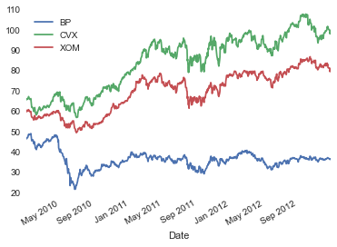
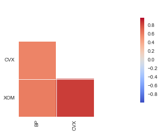

    from pandas import Series, DataFrame
    
    import pandas as pd
    
    import numpy as np
    
    import pandas.io.data as pdweb
    
    import datetime

    prices = pdweb.get_data_yahoo(['CVX', 'XOM', 'BP'], start=datetime.datetime(2010,1,1),
                               end=datetime.datetime(2013,1,1))['Adj Close']

    volume = pdweb.get_data_yahoo(['CVX', 'XOM', 'BP'], start=datetime.datetime(2010,1,1),
                                 end=datetime.datetime(2013,1,1))['Volume']

    rets = prices.pct_change()

    cor = rets.corr

    #Make a plot
    %matplotlib inline

    prices.plot()

    <matplotlib.axes._subplots.AxesSubplot at 0x10d16b310>

    prices.describe()

<table border="1" class="dataframe">
  <thead>
    <tr style="text-align: right;">
      <th></th>
      <th>BP</th>
      <th>CVX</th>
      <th>XOM</th>
    </tr>
  </thead>
  <tbody>
    <tr>
      <th>count</th>
      <td> 754.000000</td>
      <td> 754.000000</td>
      <td> 754.000000</td>
    </tr>
    <tr>
      <th>mean</th>
      <td>  36.644543</td>
      <td>  84.476560</td>
      <td>  69.958651</td>
    </tr>
    <tr>
      <th>std</th>
      <td>   4.564805</td>
      <td>  13.992004</td>
      <td>  10.146459</td>
    </tr>
    <tr>
      <th>min</th>
      <td>  22.146490</td>
      <td>  57.402290</td>
      <td>  49.959060</td>
    </tr>
    <tr>
      <th>25%</th>
      <td>  34.006580</td>
      <td>  70.020165</td>
      <td>  60.150425</td>
    </tr>
    <tr>
      <th>50%</th>
      <td>  36.771435</td>
      <td>  89.269910</td>
      <td>  72.963565</td>
    </tr>
    <tr>
      <th>75%</th>
      <td>  38.272267</td>
      <td>  95.431600</td>
      <td>  78.342977</td>
    </tr>
    <tr>
      <th>max</th>
      <td>  49.487220</td>
      <td> 108.263630</td>
      <td>  87.279530</td>
    </tr>
  </tbody>
</table>

    import seaborn as sns
    
    import matplotlib.pyplot as plt

    sns.corrplot(rets,annot=False,diag_names=False)

    <matplotlib.axes._subplots.AxesSubplot at 0x10a810cd0>

