    #FOR DATA ANALYSIS
    import pandas as pd
    import numpy as np
    from pandas import Series, DataFrame

    #FOR VISUALIZATION
    import matplotlib.pyplot as plt
    import seaborn as sns
    sns.set_style('whitegrid')
    %matplotlib inline

    #FOR READING STOCK DATA FROM YAHOO
    import pandas.io.data as web
    from pandas.io.data import DataReader
    from datetime import datetime
    from __future__ import division

    tech_list = ['BAC','APPL','INTC','MSFT']

    all_data = {}
    
    end = datetime.now()
    start = datetime(end.year - 1,end.month,end.day)
    for ticker in ['AAPL','IBM','MSFT','BAC']:
        try:
            all_data[ticker] = web.get_data_yahoo(ticker, start, end)
            price = DataFrame({tic: data['Adj Close']
                        for tic, data in all_data.iteritems()})
            volume = DataFrame({tic: data['Volume']
                        for tic, data in all_data.iteritems()})
            close = DataFrame({tic: data['Close']
                        for tic, data in all_data.iteritems()})
        except:
            print "Cant find ", ticker

    close.head()

<table border="1" class="dataframe">
  <thead>
    <tr style="text-align: right;">
      <th></th>
      <th>AAPL</th>
      <th>BAC</th>
      <th>IBM</th>
      <th>MSFT</th>
    </tr>
    <tr>
      <th>Date</th>
      <th></th>
      <th></th>
      <th></th>
      <th></th>
    </tr>
  </thead>
  <tbody>
    <tr>
      <th>2014-05-27</th>
      <td> 625.62994</td>
      <td> 15.22</td>
      <td> 184.78000</td>
      <td> 40.19</td>
    </tr>
    <tr>
      <th>2014-05-28</th>
      <td> 624.01001</td>
      <td> 15.14</td>
      <td> 183.08000</td>
      <td> 40.01</td>
    </tr>
    <tr>
      <th>2014-05-29</th>
      <td> 635.38000</td>
      <td> 15.15</td>
      <td> 183.75999</td>
      <td> 40.34</td>
    </tr>
    <tr>
      <th>2014-05-30</th>
      <td> 633.00000</td>
      <td> 15.14</td>
      <td> 184.36000</td>
      <td> 40.94</td>
    </tr>
    <tr>
      <th>2014-06-02</th>
      <td> 628.64996</td>
      <td> 15.26</td>
      <td> 185.69000</td>
      <td> 40.79</td>
    </tr>
  </tbody>
</table>

    price['MSFT'].plot(legend=True,figsize=(10,4))

    <matplotlib.axes._subplots.AxesSubplot at 0x10c3b62d0>

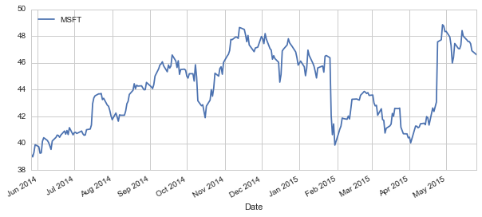

    volume['MSFT'].plot(legend=True,figsize=(10,4))

    <matplotlib.axes._subplots.AxesSubplot at 0x11791d990>

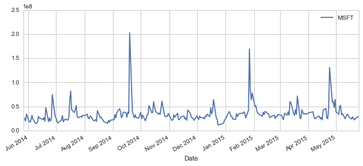

    #CALCULATING SEVERAL MOVING AVERAGES
    ma_day = [10,20,50]
    
    for ma in ma_day:
        company_name = "MA for %s days" %(str(ma))
        price[company_name] = pd.rolling_mean(price['MSFT'],ma)

    price[['MSFT', 'MA for 10 days', 'MA for 20 days', 'MA for 50 days']].plot(subplots=False,figsize=(10,4))

    <matplotlib.axes._subplots.AxesSubplot at 0x1173e2d10>

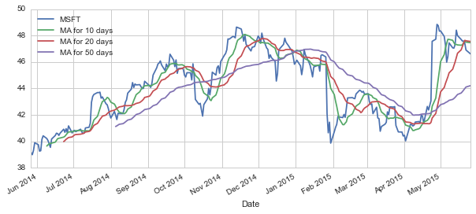

    #PCT CHANGE TO FIND THE PERCENT CHANGE FOR EACH DAY
    price['DAILY RETURN'] = price['MSFT'].pct_change()

    #PLOTTING DAILY RETURN PERCENTAGE
    price['DAILY RETURN'].plot(figsize=(12,4),legend=True,linestyle='--',marker='o')

    <matplotlib.axes._subplots.AxesSubplot at 0x10c43c690>

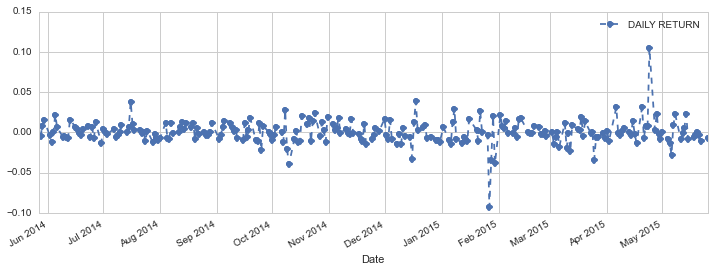

    sns.distplot(price['DAILY RETURN'].dropna(),bins=50,color='purple')

    <matplotlib.axes._subplots.AxesSubplot at 0x11a4389d0>

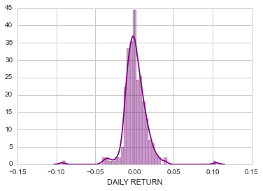

    close.head()

<table border="1" class="dataframe">
  <thead>
    <tr style="text-align: right;">
      <th></th>
      <th>AAPL</th>
      <th>BAC</th>
      <th>IBM</th>
      <th>MSFT</th>
    </tr>
    <tr>
      <th>Date</th>
      <th></th>
      <th></th>
      <th></th>
      <th></th>
    </tr>
  </thead>
  <tbody>
    <tr>
      <th>2014-05-27</th>
      <td> 625.62994</td>
      <td> 15.22</td>
      <td> 184.78000</td>
      <td> 40.19</td>
    </tr>
    <tr>
      <th>2014-05-28</th>
      <td> 624.01001</td>
      <td> 15.14</td>
      <td> 183.08000</td>
      <td> 40.01</td>
    </tr>
    <tr>
      <th>2014-05-29</th>
      <td> 635.38000</td>
      <td> 15.15</td>
      <td> 183.75999</td>
      <td> 40.34</td>
    </tr>
    <tr>
      <th>2014-05-30</th>
      <td> 633.00000</td>
      <td> 15.14</td>
      <td> 184.36000</td>
      <td> 40.94</td>
    </tr>
    <tr>
      <th>2014-06-02</th>
      <td> 628.64996</td>
      <td> 15.26</td>
      <td> 185.69000</td>
      <td> 40.79</td>
    </tr>
  </tbody>
</table>

    tech_rets = close.pct_change()

    sns.jointplot('AAPL','MSFT',tech_rets,kind='scatter')

    <seaborn.axisgrid.JointGrid at 0x1174a3790>

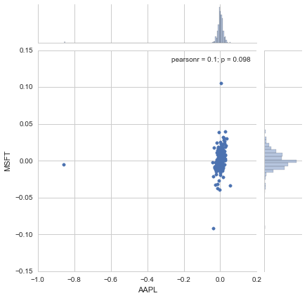

    sns.pairplot(tech_rets.dropna())

    <seaborn.axisgrid.PairGrid at 0x1174a3d10>

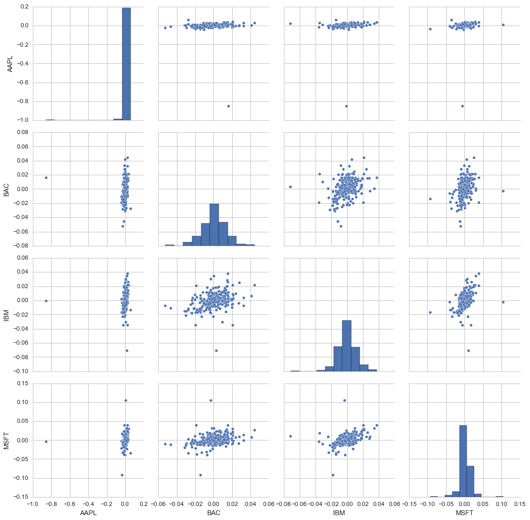

    #BUILDING SAME PAIRPLOTS USING PAIRGRID
    returns_fig = sns.PairGrid(tech_rets.dropna())
    
    returns_fig.map_upper(plt.scatter,color='purple')
    
    returns_fig.map_lower(sns.kdeplot,cmap='cool_d')
    
    returns_fig.map_diag(plt.hist,bins=30)

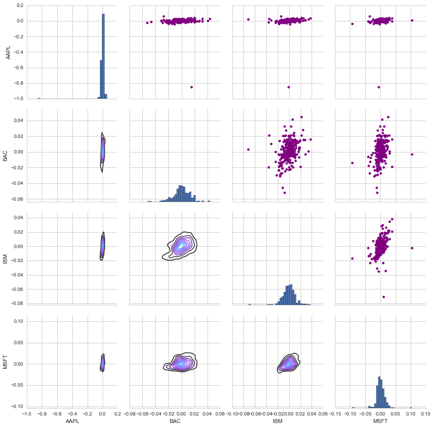

    #BUILDING SAME PAIRPLOTS USING PAIRGRID
    #BUILDING PAIRGRIDS BASED ON 
    returns_fig = sns.PairGrid(close.dropna())
    
    returns_fig.map_upper(plt.scatter,color='purple')
    
    returns_fig.map_lower(sns.kdeplot,cmap='cool_d')
    
    returns_fig.map_diag(plt.hist,bins=30)

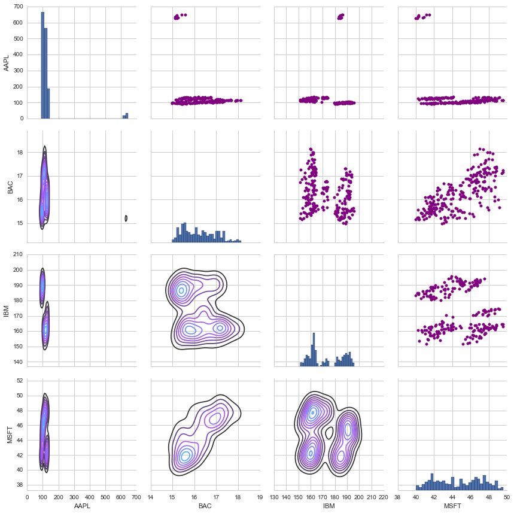

    #CREATING A CLEANER VERSION OF TECH_RETS DATASET
    rets = tech_rets.dropna()
    
    area = np.pi*20
    
    plt.scatter(rets.mean(), rets.std(),alpha = 0.5,s =area)
    
    #CREATING X AND Y LIMITS ON THE PLOT
    plt.ylim([0.01,0.025])
    plt.xlim([-0.003,0.004])
    
    #SETTING THE PLOT AXIS TITLES
    plt.xlabel('Expected returns')
    plt.ylabel('Risk')
    
    # LABELING SCATTER PLOTS
    # http://matplotlib.org/users/annotations_guide.html
    for label, x, y in zip(rets.columns, rets.mean(), rets.std()):
        plt.annotate(
            label, 
            xy = (x, y), xytext = (50, 50),
            textcoords = 'offset points', ha = 'right', va = 'bottom',
            arrowprops = dict(arrowstyle = '-', connectionstyle = 'arc3,rad=-0.3'))

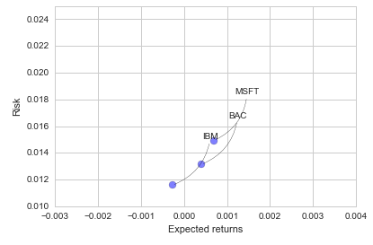

    #EMPIRICAL QUANTILE OF DAILY RETURNS
    rets['MSFT'].quantile(0.05)

    -0.014827141363174923

    # Set up our time horizon
    days = 365
    
    # Now our delta
    dt = 1/days
    
    # Now let's grab our mu (drift) from the expected return data we got for AAPL
    mu = rets.mean()['MSFT']
    
    # Now let's grab the volatility of the stock from the std() of the average return
    sigma = rets.std()['MSFT']

    def stock_monte_carlo(start_price,days,mu,sigma):
        ''' This function takes in starting stock price, days of simulation,mu,sigma, and returns simulated price array'''
        
        # Define a price array
        price = np.zeros(days)
        price[0] = start_price
        # Schok and Drift
        shock = np.zeros(days)
        drift = np.zeros(days)
        
        # Run price array for number of days
        for x in xrange(1,days):
            
            # Calculate Schock
            shock[x] = np.random.normal(loc=mu * dt, scale=sigma * np.sqrt(dt))
            # Calculate Drift
            drift[x] = mu * dt
            # Calculate Price
            price[x] = price[x-1] + (price[x-1] * (drift[x] + shock[x]))
            
        return price

    # Get start price from MSFT.head()
    start_price = 40.19
    
    for run in xrange(100):
        plt.plot(stock_monte_carlo(start_price,days,mu,sigma))
    plt.xlabel("Days")
    plt.ylabel("Price")  
    plt.title('Monte Carlo Analysis for Microsoft')

    <matplotlib.text.Text at 0x11be79410>

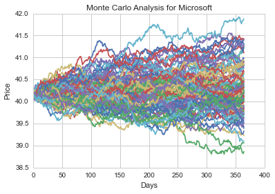

